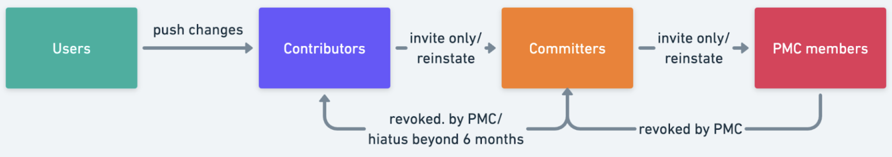
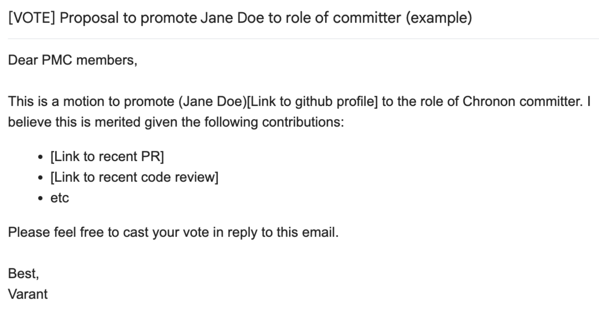
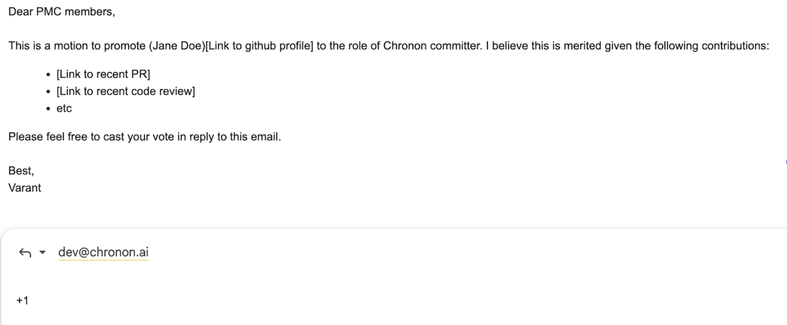
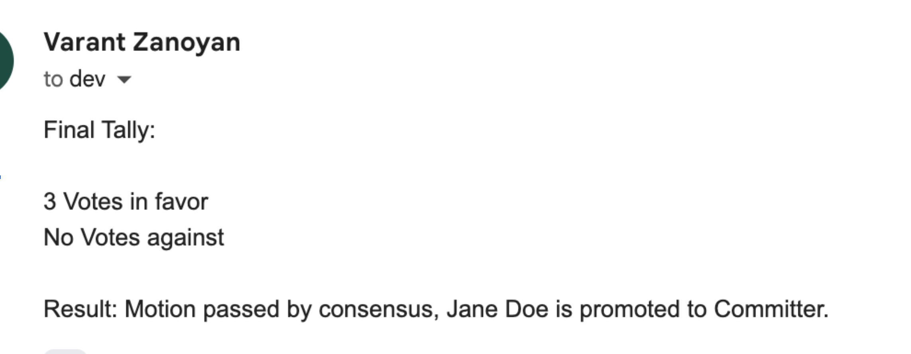

This document defines the bylaws under which the Chronon Open Source project operates, including the roles and responsibilities of various stakeholders as well as the operation of voting, resolving conflicts, and deciding on the direction of the project.
# Roles

Stakeholders of the project fall into one of the following roles:

## Users

Anybody is free to become a user of the Chronon project. 

Users contribute to the projects by providing feedback to contributors in the form of bug reports and feature suggestions. Users also participate in the community by helping other users on mailing lists and user support forums like Stack Overflow.

## Contributors

Anyone writing code, documentation, or other resources like tutorials, demos or videos is a contributor to the project. Again, anyone is welcome to become a contributor, and contributors may become committers to the project by invitation (covered below).

## Committers

The project's committers are responsible for the project's technical management. Committers have access to a specified set of subproject's subversion repositories.

Committers on subprojects may cast binding votes on any technical discussion regarding that subproject.

Committer access is by invitation only and must be approved by the lazy consensus of the active PMC members. A Committer is considered emeritus by his or her own declaration or by not reviewing patches or committing patches to the project for over six months. An emeritus committer may request reinstatement of commit access from the PMC which must be approved by a lazy consensus of the active PMC members.

Commit access can be revoked by a unanimous vote of all the active PMC members (except the committer in question if they are also a PMC member).

## Project Management Committee (PMC)

The PMC is responsible for the management and oversight of the Chronon codebase. These responsibilities include:
* Deciding what is distributed as part of the Chronon project. In particular all releases must be approved by the PMC.
* Maintaining the project's shared resources, including the codebase repository, mailing lists, websites.
* Speaking on behalf of the project.
* Resolving license disputes regarding products of the project.
* Nominating new PMC members and committers.
* Maintaining these bylaws and other guidelines of the project.

### PMC Seat Allocation

PMC seats are currently only allocated to Airbnb and Stripe organizations, meaning that PMC members must be parts of those organizations. Specifically, 8 seats are reserved for Airbnb, and 5 for Stripe.

PMC members can be declared emeritus and removed from the active list in three different ways: by their own declaration, by leaving the organization to which seats are allocated (Stripe and Airbnb), or by a consensus vote of all the active PMC members other than the member in question. In these cases, they also lose their committer status, however, they are free to be reinstated as committers immediately, following the normal protocol.

When a PMC member is removed from the active list, their organization can and should nominate a replacement. A nomination indicates unanimous approval from the PMC members of that organization, and in the absence of a veto from other PMC members, the nomination is immediately approved. Should a veto be cast by another member, it must come with a reason, and either the issue can be resolved through debate and the veto is removed, or a new member must be nominated.

Major decisions requiring PMC voting should ideally be held off until the PMC is at full membership (13 active members). However, if an urgent matter needs deciding while the PMC is below full membership, then each organization can cast proxy votes for their empty seats. It is up to each organization to decide how they wish to cast these votes.

# Decision Making

## Voting

Decisions regarding the project are made by votes on the primary project development mailing list dev@chronon.ai.

Votes are clearly indicated by the subject line starting with [VOTE]. Votes may contain multiple items for approval and these should be clearly separated. Voting is carried out by replying to the vote mail. Voting may take three flavors

| Vote | Meaning |
|  ---- | ----- |
|  +1  |  'Yes,' 'Agree,' or 'the action should be performed.' |
|  +0  | Neutral about the proposed action (or mildly negative but not enough so to want to block it). |
|  -1  | This is a negative vote. On issues where consensus is required, this vote counts as a veto. All vetoes must contain an explanation of why the veto is appropriate. Vetoes with no explanation are void. It may also be appropriate for a -1 vote to include an alternative course of action.

All eligible participants are encouraged to show their agreement with or against a particular action by voting (eligibility depends on the action being voted upon, outlined in the “Actions” section below).

For technical decisions, only the votes of active committers are binding. Non-binding votes are still useful for those with binding votes to understand the perception of an action in the wider community.

For PMC decisions, only the votes of active PMC members are binding.

Voting can also be applied to changes already made to the Chronon codebase. These typically take the form of a veto (-1) in reply to the commit message sent when the commit is made. Note that this should be a rare occurrence. All efforts should be made to discuss issues when they are still patches before the code is committed.

Only active (i.e. non-emeritus) committers and PMC members have binding votes.

## Approvals

| Approval Type |Definition |
| ------------- | ---------- |
|   Consensus   | Consensus requires 3 binding +1 votes and no -1 binding vetoes. |
| Lazy Majority |  A lazy majority vote requires 3 binding +1 votes and more binding +1 votes than -1 votes. |
| Lazy Approval |  An action with lazy approval is implicitly allowed unless a -1 vote is received, at which time, depending on the type of action, either lazy majority or consensus approval must be obtained. |
| 2/3 Majority | Some actions require a 2/3 majority of active PMC members to pass. Such actions typically affect the foundation of the project (e.g. adopting a new codebase). The higher threshold is designed to ensure such changes are strongly supported. To pass this vote requires at least 2/3 of binding vote holders to vote +1. |

## Vetoes

A valid, binding veto cannot be overruled. If a veto is cast, it must be accompanied by a valid reason explaining the reasons for the veto. The validity of a veto, if challenged, can be confirmed by anyone who has a binding vote. This does not necessarily signify agreement with the veto - merely that the veto is valid.

If you disagree with a valid veto, you must lobby the person casting the veto to withdraw their veto. If a veto is not withdrawn, the action that has been vetoed must be reversed in a timely manner.

Only active members of the PMC have the ability to veto, and all active PMC members may veto any vote.
## Actions

| Actions | Description | Approval | Binding Votes | Minimum Length (days) | Mailing List |
| ------- | ----------- | -------- | ------------- | --------------------- | ------------ |
| Code Change | A change made to a codebase of the project and committed by a committer. This includes source code, documentation, website content, etc. | A +1 from a committer (Github approval counts as a +1). Moving to a lazy majority if a -1 is received (github rejection counts as a -1). A -1 from a committer counts as a veto. It must come with an explanation, and ideally it should be resolved through code change and petition. If it fails to be resolved through dialogue after 3 days, the on-call, or another PMC member, will intervene to try to reach consensus. If that also fails, then the veto can be overturned by a lazy majority vote amongst PMC voters. |  Active committers |  0 | Github Pull Request (automated notification sent to dev@chronon.ai) |
| Major Change | A major change to the codebase. Exact definition of “major” TBD. | Consensus (3 github approvals), with the same veto rules as a minor code change. | Active PMC Members |  3 |Github Pull Request (automated notification sent to dev@chronon.ai) |
| Chronon Improvement Process Proposal (CHIP) | A required proposal prior to any major change. | Consensus (3 github approvals), with the same veto rules as a minor code change. | Active PMC members | 3 | Github Pull Request (automated notification sent to dev@chronon.ai) |
| Release Plan | Defines the timetable and actions for a release. The plan also nominates a Release Manager. | Lazy majority | Active PMC Members | 3 | dev@chronon.ai |
| Product Release | When a release of one of the project's products is ready, a vote is required to accept the release as an official release of the project. | Lazy Majority | Active PMC members | 3 | dev@chronon.ai |
| Adoption of New Codebase | Adoption of large existing external codebase. This refers to contributions big enough that potentially change the shape and direction of the project with massive restructuring and future maintenance commitment. | 2/3 majority | Active PMC members | 6 | dev@chronon.ai |
| New Committer | When a new committer is proposed for the project. | Consensus | Active PMC members | 3 | private@chronon.ai |
| New PMC Member | When a committer is proposed for the PMC. | Consensus | Active PMC membersx | 3 | private@chronon.ai | Committer Removal | When removal of commit privileges is sought. | Consensus | Active PMC members (excluding the committer in question if a member of the PMC). | 6 | private@chronon.ai |
| PMC Member Removal |  When removal of a PMC member is sought. |  Consensus | Active PMC members (excluding the member in question). | 6 | private@chronon.ai |
| Modifying Bylaws | Modifying this document. | 2/3 majority | Active PMC members | 6 | dev@chronon.ai |

## Reverting

The on-call is free to use their discretion to revert any PR, even if it fulfills the conditions outlined above for merging. The cases where the on-call may elect to do this include, but are not limited to:
* The PR breaks the pipeline/CI
* The conditions under which it was merged did not allow for proper review (for example very late PR time with quick stamps and merging)
* The PR was merged as a minor change, but the on-call determines that it more closely resembles a major change

# Examples

## Minor code change

Including bug fixes, small features and extensions.

1. Contributor opens up a PR
2. If the PR gets at least one +1 from an active committer without any -1, then it’s merged.
3. If the PR gets a -1 from an active committer or a PMC member (the -1 must come with an explanation)
    1. Ideally the rejection is resolved through code change/discussion amongst the parties involved (initial committer as well as vetoer)
    2. If after 3 days the discussion hasn’t yielded any progress, the on-call or another PMC member will get involved to try and guide the conversation to a productive consensus
    3. Should that fail, then the on-call or PMC member will inform the rest of the PMC that debate has failed and then we will move ahead with a lazy majority vote amongst PMC members to resolve the issue.

## Major code change

These should have an associated CHIP (see contributor guide) that is already approved by a Consensus vote of PMC members.

1. Contributor opens up a PR
2. If the PR gets at least three +1s from active committers without any -1s, then it’s merged.
3.  If the PR gets a -1 from an active committer or a PMC member (the -1 must come with an explanation)
    1. Then we follow the same process as for a minor change, however without any guidelines as to how long the debate will continue for. The on-call or PMC member(s) resolving the debate are free to let it go on for longer before calling for a vote to resolve the issue, especially if the change is consequential for the future direction of the project.

## Major vs Minor Changes

We do not have a formal definition of major, but as a rough guideline any change that fulfills any of the below criteria could be considered major:
* Touches 10+ files in a significant way
* Sensitive changes such as:
    * Edit, add, or remove major libraries or components, for example introducing a new dependency
    * Any change to APIs, even backwards compatible changes like adding optional arguments
    * Any change to core aggregation libraries
    * Changing the default configurations of any parameters
* More than ~500 lines of code

The final decision on what constitutes a major change will be left up to the on-call at the time that the PR is merged.

If a PR is merged under the “minor change” process, but the on-call determines that it is in fact a “major change”, then they are free to immediately revert the PR and call for the major change process.

## Proposed Re-architectures and Directional Changes

Large re-architectures begin with a CHIP, which is the most important part of the process, where the overall vision and design is layed out. The CHIP itself follows an approval process identical to a major code change.

Once the CHIP is approved, the PRs that comprise the change follow the normal  approval processes in line with their status as either major or minor.

# Licensing, Copyright / Ownership

The code will be licensed under the standard Apache v2 license without any modifications. This is the most popular, permissive, liability-and-warranty-voiding open-source license.

The ownership/copyright of the project will belong to “The Chronon Authors” which is a collective group of people that have contributed code and documentation to the project - any one with a github PR that’s been committed. This is standard industry practice and is followed by companies such as Google and Organizations such as Linux foundation - more details [here](https://opensource.google/documentation/reference/releasing/authors) and [here](https://www.linuxfoundation.org/blog/blog/copyright-notices-in-open-source-software-projects).

# Appendix

## Email Voting Example - New Committer

Initial email to set the motion forward (sent to dev@chronon.ai):

A simple +1 or -1 is all that is required in reply:

After at least three days, and 3 positive votes with no vetoes:

