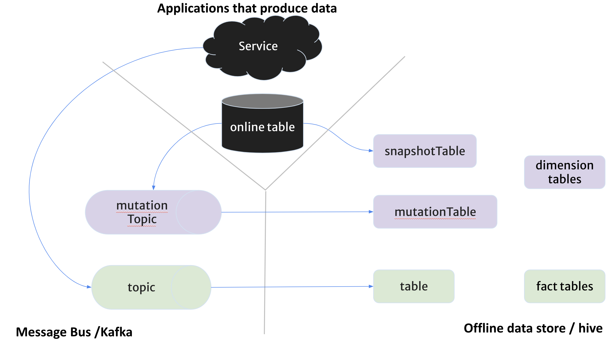
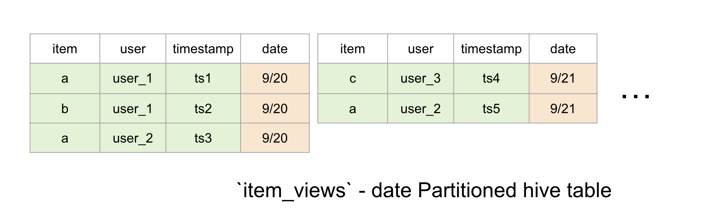
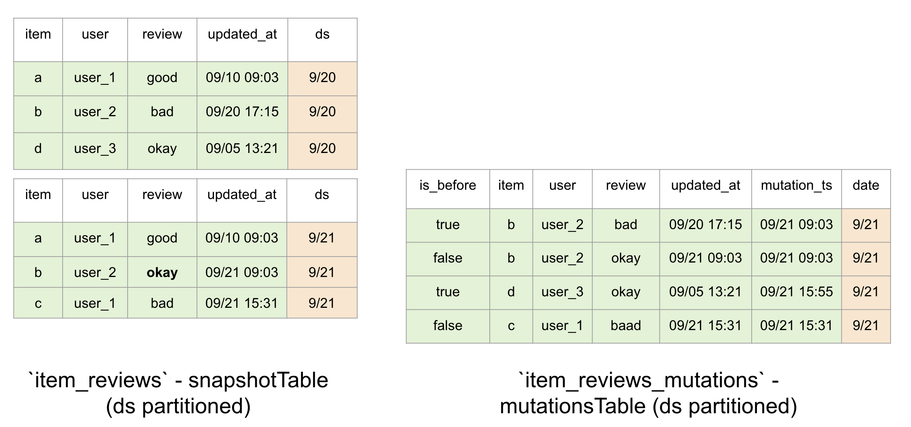
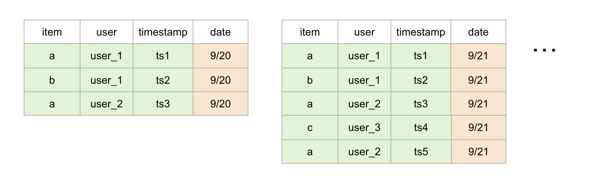

# Concepts

Chronon has concepts to capture a variety of sources and computation semantics
that simultaneously apply to generating training-data and serving features.

Our philosophy behind coming up with these concepts is to align as closely as possible with
your mental model of data processing so that your express your ideas easily.
To achieve this, we use familiar sql concepts with powerful, well-integrated enhancements. 

You will be describing your computation as a combination of python and spark sql expressions. Python because it 
makes composing concepts together and managing complexity easy. Spark sql, because you will have access to 
a vast library of built-in functions, UDFs to manipulate parquet data without sacrificing performance. 

In this section, we are going to use an example to explain the concepts. 

## Example

Let's say you want to enrich a table of observations with two new columns representing

1. User's count of views of items in the last 5 hours - from a view event source.
2. Item's average rating in the last 90 days - from a database's rating table.

The table of observations might look like

| user_id |  item_id  |     timestamp     |
|---------|-----------|-------------------|
|  alice  |  pizza    |  2021-09-30 5:24  |
|   bob   | ice-cream |  2021-10-15 9:18  |
|  carl   |  pizza    |  2021-11-21 7:44  |

You would expect an output that is enriced with features that looks like

| user_id |  item_id  |      timestamp      | views_count_5h  | avg_rating_90d |
|---------|-----------|---------------------|-----------------|----------------|
|  alice  |  pizza    |    2021-09-30 5:24  |       10        |       3.7      |  
|   bob   | ice-cream |    2021-10-15 9:18  |        7        |       4.5      |
|  carl   |  pizza    |    2021-11-21 7:44  |       35        |       2.1      |

Users use this data, typically, as features, to train machine learning models. These models also require these aggregations while serving to make predictions.
So online we get a request that translates to something like - "produce the view count in the last 5hrs, and average rating in the last 90 days, **ending now** for a user named Bob".

You would express the computation in Chronon using `GroupBy` and `Join`

- Average rating of the item in the last 90 days as a `GroupBy`

```python
ratings_features = GroupBy(
    sources=[
        EntitySource(
            snapshotTable="item_info.ratings_snapshots_table",
            mutationsTable="item_info.ratings_mutations_table",
            mutationsTopic="ratings_mutations_topic",
            query=query.Query(
                selects={
                    "rating": "CAST(rating as DOUBLE)"
                }))
    ],
    keys=["item"],
    aggregations=[
        Aggregation(
            operation=Operation.AVERAGE,
            windows=[Window(length=90, timeUnit=TimeUnit.DAYS)])
    ])
```

- Number of times the user viewed the item in the last 5 hours as a `GroupBy`

```python
view_features = GroupBy(
    sources=[
        EventSource(
            table="user_activity.user_views_table",
            topic="user_views_stream",
            query=query.Query(
                selects={
                    "view": "if(context['activity_type'] = 'item_view', 1 , 0)",
                },
                wheres=["user != null"]
            ))
    ],
    keys=["user", "item"],
    aggregations=[
        Aggregation(
            operation=Operation.COUNT, 
            windows=[Window(length=5, timeUnit=TimeUnit.HOURS)]),
    ])
```

- `GroupBy` is essentially a collection of features that are aggregated from sources with similar data. You can put features from different GroupBy's together using a `Join`.

```python
item_rec_features = Join(
    left=EventSource(
        table="user_activity.view_purchases",
        query=query.Query(
            start_partition='2021-06-30'
        )
    ),
    ## keys are automatically mapped from left to right_parts
    right_parts=[JoinPart(groupBy = view_features), JoinPart(groupBy = ratings_features)],
)
```

Full code [example](https://gist.github.com/nikhilsimha/13cf46b93116bc3b0b08b4adc1483bd1)

## More Examples

The document below goes into a bit more detail about each of the concepts. 
You can find examples [here](https://github.com/airbnb/chronon/tree/master/api/py/test/sample) instead.

## Source
Source in chronon refers to a logical group of underlying physical data sources. There are two types of sources
- Events
- Entities 
- Cumulative 

The following diagram visualizes these sources


### Events
Events represent log of immutable events - like user views, clicks, transactions etc. Events are represented by
two data elements

- table => A daily partitioned hive table with each partition containing the events that occur during that day only. You
  can also use any `fact` table that is derived from some other offline logic - if you don't care about realtime-ness. 
- topic => A kafka topic that the events flow through before ending up in hive. This is optional, and only needed if you
are trying to produce realtime-features
  
Usually you will have a naming convention between the topic name and table name. It is a good idea to capture that in a
helper method that is re-used across your organization.

```python
# Example assuming arbitrary naming convention
def MyEventSource(event_name, *args, **kwargs):
    return EventSource(table=f"some_namespace.{event_name}_log",                
                        topic=f"{event_name}_mutations/host=YOUR_KAFKA_HOST/port=YOUR_KAFKA_PORT",
                        *args, **kwargs)
```

>**Note**: The dates and timestamps below are shortened for brevity. You should have dates in `yyyy-MM-dd`
> format, and timestamps as long values representing milliseconds since epoch in UTC. You can specify a time 
> transformation as an argument to `EventSource.query.timeColumn`. 



### Entities

In purple we have a group of data elements, that represents changing data in an online database table that 
application services use. 

 - `snapshotTable` => A daily partitioned table in hive with full snapshot of online table taken every midnight. A tool 
   like [Sqoop](https://sqoop.apache.org/) etc can produce these snapshotTables into hive. You should already have a 
   mechanism that captures online table snapshots into hive periodically. This can also be any `dim` / `dimension` table.
 - `mutationTopic` => A topic in kafka containing mutations to the table rows. A tool like [Debezium](https://debezium.io/)
   can be attached to your online database to stream mutations into kafka.
 - `mutationTable` => A daily partitioned hive table containing mutations that happened in a particular day in each partition.

> **Note**: that `mutationTopic` and `mutationTable` are only necessary for realtime feature serving and PITC backfill 
> respectively. If you don't have these two sources, you can still use just the `snapshotTable` for constructing 
> midnight accurate (non-realtime) features. 

If you have a convention around the all db related tables, it might be worth creating a method that produces a full 
entity source with all three elements specified. 
```python
# Example assuming arbitrary naming convention
def DBExportSource(table_name, *args, **kwargs):
    return EntitySource(snapshotTable=f"{table_name}_snapshots",
                        mutationTable=f"{table_name}_mutations",
                        mutationTopic=f"{table_name}_mutations/host=YOUR_KAFKA_HOST/port=YOUR_KAFKA_PORT",
                        *args, **kwargs)
```

See example ratings table 


>**Note**: Dates and timestamps are shortened for brevity. MutationTable is an unpacked version. There are three kinds of
> mutations deletes, updates and inserts. `mutationTs` is modified for brevity, but it should be a long representing
> the time at which the update occurred in milliseconds since epoch.
> - Updates are unpacked into two rows - a before-update-row: `is_before = True` 
> and an after-update-row: `is_before = False`.  
> 
> - Inserts are unpacked into a single row where `is_before = False`.
> 
> - Deletes are unpacked into a single row where `is_before = True`.
> 
> You can expand the DBExportSource method above to fit your mutation data into these conventions once for your company.
 

### Cumulative Events

This is the case where, only new rows are added into new partitions, and old rows's columns that you care about are never 
 modified. This implies that latest partition always contain all data from the previous partition. The advantage of 
this is that we can always look at latest partition instead of a historical range.

This is specified as a sub-case of Events as `Events(cumulative=True)`.

See example


> Note: Declaring a source as Cumulative one comes with enormous performance benefits compared to EntitySource. But
> you need to be 100% sure that the columns you want to consume are never modified.

## Query

Once you have chosen the right source type, the next step is to specify a query that can scan the **necessary** data.
That is where the `Query` comes in.  
row level transformation and filtering. We use spark sql expressions to power this & all built-in functions & UDFs are 
supported.


---

## GroupBy
A **GroupBy** is a group of [Aggregations](Aggregations.md) computed from a `Source` or similar `Source`s of data.

Consider the following group of aggregations from an user purchase stream `(user, credit_card, merchant, price, timestamp)` that are `key`-ed on user.

- `average` of purchase prices of a user in last 7d, 30d & 90d windows.
- `top_k(10)` purchase prices of a user in the last 365d window
- `unique_count` of merchants of a user - in all history.
- `average` purchase price of a user **bucketed** by merchant - result is a map of merchant to average purchase price.

The above example illustrates the computation of aggregates in several contexts.

- **served online**, updated in **realtime** - you can utilize the Chronon client (java/scala) to query for the aggregate values as of **now**. The client would reply with realtime updated aggregate values. This would require a *stream* of user purchases and also a warehouse (hive) *table* of historical user purchases.

- **served online**, updated at **midnight** - you can utilize the client to query for the aggregate values as of **today's midnight**. The values are only refreshed every midnight. This would require just the warehouse (hive) table of historical user purchases that receives a new partition every midnight.
  - *Note: Users can configure accuracy to be midnight or realtime*

- **standalone backfilled** - daily snapshots of aggregate values. The result is a date partitioned Hive Table where each partition contains aggregates as of that day, for each user that has row in the largest window ending that day.

- **backfilled against another source** - see [Join](#join) below. Most commonly used to enrich labelled data with aggregates coming from many different sources & GroupBy's at once.

**selecting the right Source for your `GroupBy`** is a crucial first step to correctly defining a `GroupBy`. 
See the [Sources](#source) section above for more info on the options and when to use each.

Often, you might want to chain together aggregations (i.e., first run `LAST` then run `SUM` on the output). 
This can be achieved by using the output of one `GroupBy` as the input to the next.

### Aggregations
Chronon supports a powerful aggregation primitive that supports time windows, bucketing and auto-exploding as first class
primitives. [See aggregations.md](./Aggregations.md) for more details. 

### Accuracy
`accuracy` is a toggle that can be supplied to `GroupBy`. It can be either `SNAPSHOT` or `TEMPORAL`.
`SNAPSHOT` accuracy means that feature values are computed as of midnight only and refreshed once daily.
`TEMPORAL` accuracy means that feature values are computed in realtime while serving, and in point-in-time-correct 
fashion while backfilling.
When topic or mutationTopic is specified, we default to `TEMPORAL` otherwise `SNAPSHOT`.


### GroupBy Online (Serving)
`online` is a toggle to specify if the pipelines necessary to maintain feature views should be scheduled. This is for 
online low-latency serving. 

```python
your_gb = GroupBy(
  ...,
  online=True
)
```
> Note: Once a groupBy is marked online, the compiler `compile.py` will prevent you from updating it. This is so that
> you don't accidentally merge a change that release modified features out-of-band with model updates. You can overwrite
> this behavior by deleting the older compiled output. Our recommendation is to create a new version `your_gb_v2` instead.

#### [Click here for more configuration examples](https://github.com/airbnb/chronon/blob/master/api/py/test/sample/group_bys)

## Join

A join can pull data from GroupBy's that are keyed on different entities. As you saw in the [example section](#example) 
above, `view_features` are keyed by `item` & `user` and `ratings_features` are keyed only by `item`.
Key feature of a join is that it can operate both online and offline with consistency. Meaning the offline back-filled 
values are the same as online served values, and there is a single definition governing both.

Chronon runs daily pipelines that measure inconsistency between an offline join, and an online joins.

[Join](../../api/py/ai/chronon/join.py) has essentially two things - a `left` source and `right_parts`. 
 - `left` source is the source against which aggregates are being computed for. The left source only matter for offline 
   backfilling and not used in serving.
   - One of the main things to determine about your left source, is whether it is an event or an entity. 
   - Only events can be used to trigger realtime / point-in-time-correct backfills. Entities always trigger a daily accurate backfill.
   - Only events can be used to trigger realtime / point-in-time-correct backfills. Entities always trigger a daily accurate backfill.
   - If you are predicting online - in a service in realtime, you usually want an EventSource as your `left`. In this case
     providing a `timeColumn` - as milliseconds in UTC since epoch - is essential.
   - If you are predicting offline - once every day, you want an Entity source on your `left`.
 - `right_parts` is a list of [JoinPart](../../api/py/ai/chronon/join.py)s containing group_by's to join with. This has an optional `prefix` and key re-mapping facility. 
    - `prefix` - just adds the specified string to the names of the columns from group_by
    - `keyMapping` - is a map of string to string. This is used to re-map keys from left side into right side. You could have 
   a group_by on the right keyed by `user`. On the left you have chosen to call the user `user_id` or `vendor`. Then you
   can use the remapping facility to specify this relation for each group_by.

> NOTE: The online flag in a Join states that this join is going to be fetched online. Metadata about the join is 
> uploaded and there are checks to make sure each GroupBy used by the Join is set to online as well.

> NOTE: The production flag in a Join states that the join is not in development anymore and critical alerting and 
> monitoring are expected. If a Join is marked as production it cannot reference any non-production GroupBys.
### [Click here for more configuration examples](https://github.com/airbnb/chronon/blob/master/api/py/test/sample/joins)


## Staging Query
A StagingQuery can be used to express free form ETL (including joins/group by) within Chronon. They are typically used
to express more complex logic that won't fit into the simple `query` facility provided by the source.

```python
v1 = StagingQuery(
    query="select * from namespace.table a JOIN namespace.table_2 b on a.key=b.key ",
    startPartition="2020-04-01",
    setups=[
        "ADD JAR s3://path/to/your/jar",
        "CREATE TEMPORARY FUNCTION YOUR_FUNCTION AS 'com.you_company.udf.your_team.YourUdfClass'",
    ],
    metaData=MetaData(
        dependencies=["namespace.table", "namespace.table_2"],
    )
)
```

The StagingQuery can then be used in both GroupBy and Join. For ex:
```python
from staging_queries.team_name_folder import file_name
from ai.chronon.utils import get_staging_query_output_table_name
v1 = Join(
    left=EventSource(
        table=get_staging_query_output_table_name(file_name.staging_query_var_name)
        ...
    )
)
```

Note: The output namespace of the staging query is dependent on the metaData value for output_namespace. By default, the 
metadata is extracted from [teams.json](../../api/py/test/sample/teams.json) in (or default team if one is not set).

### [Click here for more configuration examples](https://github.com/airbnb/chronon/blob/master/api/py/test/sample/staging_queries)
