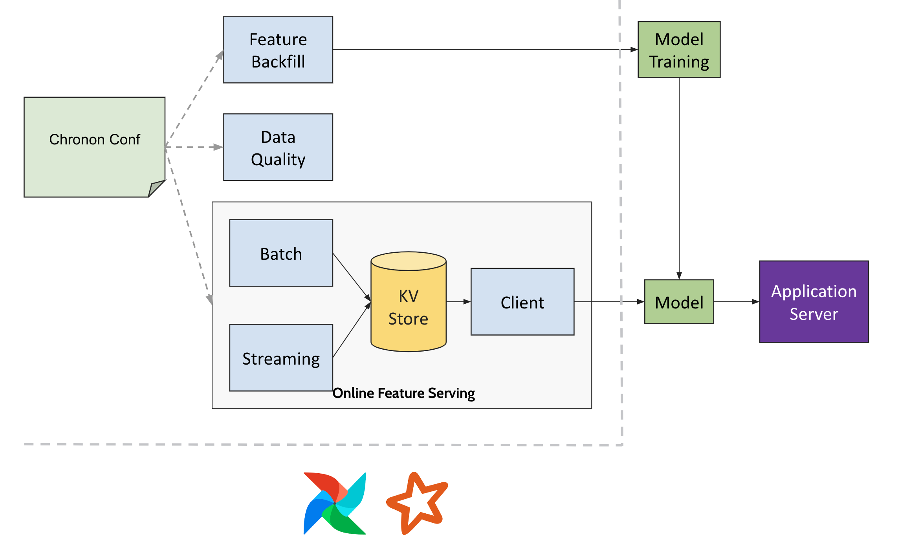

# Getting Started

Chronon essentially can operate in two modes - online and offline.
Using Chronon offline for the first time is designed to be really simple.

Online however, you would need to teach chronon how to talk to your Key-Value store
and how to understand the data that is in your kafka message bus. This is a one time setup.

This article contains information required to setup and use Chronon.

## Initial Setup
1. If you wish to work in an existing chronon repo, simply run
```shell
pip install chronon-ai
```
2. If you wish to setup the chronon repo and install the package, simply run the command below and fill out the spark path in `./chronon/teams.json`
```shell
curl -s https://chronon.ai/init.sh | $SHELL
```

At this point you will have a repo starting point and three tools on your path.
The repo contains three folders - `group_bys`, `joins` and `staging_queries` where you add your code.

1. `compile.py` - which tells you whether your configuration is valid and compiles it into
   something the chronon engine can execute. The output of this goes into the `production` folder.
1. `run.py` - which can take your compiled *conf* and runs it in a *mode* of your choosing.
1. `explore.py` - which allows you to keyword or lineage search all the existing definitions.

## Compile

Compilation to JSON is done via `compile.py`. Chronon can interpret the compiled artifacts
for managing metadata, creating data processing pipelines, online serving etc.

```shell
compile.py --conf=<conf_type>/<team>/<conf_name>.py
```

- `conf_type` can be "staging_queries" or "group_bys" or "joins"
- `team` is your team name as registered in [teams.json](../../api/py/test/sample/teams.json)
- `conf_name.py` is the python file where you put your compute definition.

## Run

There are three main API concepts that can be executed in Chronon - GroupBy, Join & StagingQuery.
Please familiarize yourself with the Python API.
There are a few modes in which these primitives can be executed using `run.py`.

- **GroupBy** - backfill, upload, streaming, fetching, analyze
- **Join** - backfill, fetching, analyze, consistency
- **StagingQuery** - backfill

Each of these modes take the compiled json of the python API and do a specific action.

## Offline modes
- **analyze** - does full validation of the sql expressions used in the python API,
  prints the result schema and optionally does heavy hitter/hot key detection.
- **backfill** - mode reads data from hive and produces data into hive according to compute definition.

## Online modes
- **upload** - reads data from hive and bulk uploads data into KVStore.
- **streaming** - reads data from kafka and adds into KVStore.
- **fetch** - reads values from kv store, does some compute if necessary and return a result.
- **consistency** - runs the job to compare online served values against backfilled values.
  See [Online-Offline Consistency doc](./Online_Offline_Consistency)

You can run the configs in their modes using run command

```shell
run.py --mode=<MODE> --conf=<PATH>/<TO>/<YOUR>/<DEFINITION>
```

You can directly tune the parameters setup as env-vars set in [spark_submit.sh](../../api/py/test/sample/scripts/spark_submit.sh)
or [spark_submit_streaming.sh](../../api/py/test/sample/scripts/spark_submit_streaming.sh) via `run.py` script.

```shell
EXECUTOR_MEMORY=16G PARALLELISM=2000 run.py --mode=backfill --conf=production/joins/<your_team>/<your_join>
# or
EXECUTOR_MEMORY=2G PARALLELISM=8 run.py --mode=streaming --conf=production/group_bys/<your_team>/<your_group_by>
```

## Explore

Finally, if you want to explore *existing* feature definitions in Chronon, use `explore.py` with any key word like `user`, `views` etc.,
This will list out instances where, source table, group_by name, aggregate column name or join name *contains* the keyword.

```shell
explore.py <KEYWORD>
```

## Integrations



There are essentially four integration points:

- Chronon Repository - This is where your users will define Chronon configurations. 
  We recommend that this live within an airflow pipeline(or your own data pipeline scheduler's) repository to make deployment easy. 
  Once you have the repository setup you can begin using Chronon for offline batch pipelines. Please fill out your spark submit path
  and your date partitioning conventions in `teams.json`.

- For online Serving
    - KVStore - for storing and serving features in low latency. This can be any kv store that can support point write, point lookup, scan and bulk write.
    - StreamDecoder - for reading bytes from kafka and converting them into a Chronon Event or a Chronon Mutation. If you have a convention between how you convert data in kafka into data in warehouse, you would need to follow that same convention to decode as well.

- Airflow - for scheduling spark pipelines that periodically checks and triggers missing tasks, join backfills, group by uploads, meta data uploads, etc.


## KV Store API
KVStore API has three methods for you to implement (once per company).
- `multiPut` of a series of triples `keys, value, time` called `TimedValue`.
- `multiGet` of a series of tuples `keys, Option[time]` - which return `TimedValue`.
  You can map time as a **secondary key** that comes standard in no-sql stores.
- `bulkPut` - to upload a hive table into your kv store. If you have another mechanism
  (like an airflow upload operator) to upload data from hive into your kv stores you don't need
  to implement this method.

```scala
object KVStore {
  // `afterTsMillis` implies that this is a range scan of all values with `timestamp` >= to the specified one. This can be implemented efficiently, if `timestamp` can be a secondary key. Some databases have a native version id concept which also can map to timestamp.
  case class GetRequest(keyBytes: Array[Byte], dataset: String, afterTsMillis: Option[Long] = None)

  // response is a series of values that are 
  case class TimedValue(bytes: Array[Byte], millis: Long)
  case class GetResponse(request: GetRequest, values: Try[Seq[TimedValue]]) {
    def latest: Try[TimedValue] = values.map(_.maxBy(_.millis))
  }

  case class PutRequest(keyBytes: Array[Byte], valueBytes: Array[Byte], dataset: String, tsMillis: Option[Long] = None)
}

trait KVStore {
  def create(dataset: String): Unit

  // Used by the Chronon client to fetch features
  def multiGet(requests: Seq[GetRequest]): Future[Seq[GetResponse]]

  // Used by spark streaming job to write values
  def multiPut(keyValueDatasets: Seq[PutRequest]): Future[Seq[Boolean]]

  // Used by spark upload job to bulk upload data into kv store
  def bulkPut(sourceOfflineTable: String, destinationOnlineDataSet: String, partition: String): Unit
}
```

## Stream Decoder API
Simple deserializer API to decode bytes in a kafka stream into java values.
Java values are expected to be a `Mutation` - which capture two kinds of data.
1. Events - Eg., Bank transactions - `source_account`, `target_account`, `amount`, `timestamp`
2. Mutations - Eg., Bank Balance table with row: `account`, `balance`, `update_at`
    - A mutation event would contain a `before` row and an `after` row
    - Both `before` and `after` have `account`, `balance`, `updated_at`.
    - If mutation is a db table insert - before is null, after should contain values.
    - If mutation is a table delete - after is null, before should contain value.
    - If mutation is an update - both before and after should be present.
3. Events are special of Mutations / inserts. Before is always null, only `after` is specified.

You can use [Apache Debezium](https://debezium.io/) if you don't have a Mutation capture system in place. Until
then you can simply use Chronon for `Events` case for online serving of realtime features.

```scala

case class Mutation(schema: StructType = null, before: Array[Any] = null, after: Array[Any] = null)

abstract class StreamDecoder extends Serializable {
  def decode(bytes: Array[Byte]): Mutation
  def schema: StructType
}
```

Chronon has a type system that can map to Spark's or Avro's type system. Schema is based on the below table which contains Java types corresponding to the Chronon schema types. StreamDecoder should produce mutations that comply.


| Chronon Type   |  Java Type            |
|----------------|-----------------------|
| IntType        | java.lang.Integer     |
| LongType       | java.lang.Long        |
| DoubleType     | java.lang.Double      |
| FloatType      | java.lang.Float       |
| ShortType      | java.lang.Short       |
| BooleanType    | java.lang.Boolean     |
| ByteType       | java.lang.Byte        |
| StringType     | java.lang.String      |
| BinaryType     | Array[Byte]           |
| ListType       | java.util.List[Byte]  |
| MapType        | java.util.Map[Byte]   |
| StructType     | Array[Any]            |


Putting stream decoder and kv store together, you need to implement the abstract class below.

```scala
abstract class Api(userConf: Map[String, String]) extends Serializable {
  def streamDecoder(groupByServingInfoParsed: GroupByServingInfoParsed): StreamDecoder
  def genKvStore: KVStore
}
```

Once you have the api object you can build a fetcher class using the api object like so
```scala
val api = new MyApiImplementation(myParams)
val fetcher = api.buildFetcher()
//or
val javaFetcher = api.buildJavaFetcher()

// you can use fetcher to begin fetching values (there is a java version too)
fetcher.fetchJoins(Seq(Request(name="my.join.name", keys=Map("user" -> "bob", "item" -> "pizza"))))

// if your date partition column convention in your warehouse differs from "yyyy-MM-dd" you should set a partitionSpec
fetcher.setPartitionSpec("yyyyMMdd")
```

`userConf` is captured from commandline arguments to the `run.py` script or to the 
`chronon-uber-jar` with `ai.chronon.spark.Driver` as the main class `-Zkey1=value1 -Zkey2=value2` 
becomes `{key1: value1, key2: value2}` initializer argument to the Api class. You can use
that to set KVStore params, or kafka params for streaming jobs or bulk upload jobs.


