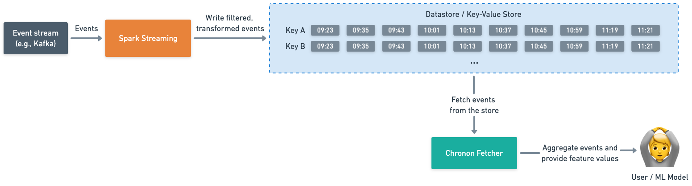
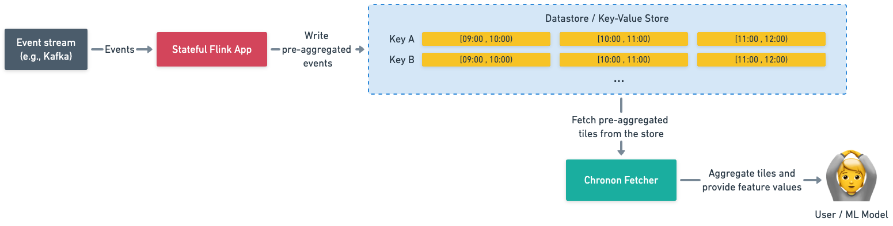

# The Tiled Architecture

**Important**: Tiling is a new feature that is still in the process of being open-sourced.

## What is tiling?

Tiling, or the tiled architecture, is a modification to Chronon's online architecture to store pre-aggregates (also
known as "IRs" or Intermediate Representations) in the Key-Value store instead of individual events.

The primary purpose of tiling is to improve the handling of hot keys, increase scalability, and decrease feature serving
latency.

Tiling requires [Flink](https://flink.apache.org/).

### Chronon without tiling

The regular, untiled version works as pictured in Figure 1.

- The "write" path: reads an event stream, processes the events in Spark, then writes them out to a datastore.
- The "read" path: reads O(events) events from the store, aggregates them, and returns the feature values to the user.


_Figure 1: The untiled architecture_

At scale, aggregating O(n) events each time there is a request can become costly. For example, if you have an event
stream producing 10 events/sec for a certain key, a request for a feature with a 12-hour window will have to fetch and
aggregate 432,000 events every single time. For a simple GroupBy that counts the number of events for a key, Chronon
would iterate over 432,000 items and count the total.

### Chronon with tiling

The tiled architecture, depicted in Figure 2, works differently:

- The "write" path: reads an event stream, processes and pre-aggregates the events in a stateful Flink app, then writes
  out the pre-aggregates to "tiles" in the store.
- The "read" path: reads O(tiles) tiles from the store, merges the pre-aggregates, and returns the feature values to the
  user.


_Figure 2: The tiled architecture_

Tiling shifts a significant part of the aggregation work to the write path, which allows for faster feature serving.

Using the same example as above (an event stream producing 10 events/sec for a certain key, and a GroupBy with a 12-hour
window), a request for feature values would fetch and merge 12 or 13 1-hour tiles. For a simple GroupBy that counts the
number of events for a key, Chronon would iterate over 13 numbers and add them together. That's significantly less work.

#### Example: Fetching and serving tiled features

Suppose you have a GroupBy with two aggregations, `COUNT` and `LAST`, both using 3-hour windows, and you are storing
1-hour tiles in KV Store. To serve them, the Chronon Fetcher would fetch three tiles:

```
[0:00, 1:00) -> [2, "B"]
[1:00, 2:00) -> [9, "A"]
[2:00, 3:00) -> [3, "C"]
```

Then, it would combine the IRs to get the final feature values: `[14, "C"]`.

## When to use tiling

In general, tiling improves scalability and decreases feature serving latency. Some use cases are:

- You want to decrease feature serving latency. At Stripe, migrating to tiling decreased serving latency by 33% at 4K
  rps.
- You don't have access to Spark Streaming
- You don't have access to a datastore with range queries
- You want to reduce fanout to your datastore.
- You need to support aggregating over hot key entities

In particular, organizations operating at significant scale with many hot-key entities should consider using the tiled
architecture. If the number of events per entity key is at most a few thousand, the untiled approach would still perform
well.

## How to enable tiling

To enable tiling, you first need to start using Flink on the write path. See
the [Chronon on Flink documentation](setup/Flink.md) for instructions. As part of this process, you may also need to
modify your KV store implementation to know how to write and fetch tiles.

Once the Flink app is set up and writing tiles to your datastore, the final step is to enable tiled reads in the
Fetcher. Just add `enable_tiling=true` to
the [customJson](https://github.com/airbnb/chronon/blob/48b789dd2c216c62bbf1d74fbf4e779f23db541f/api/py/ai/chronon/group_by.py#L561)
of any GroupBy definition. 
