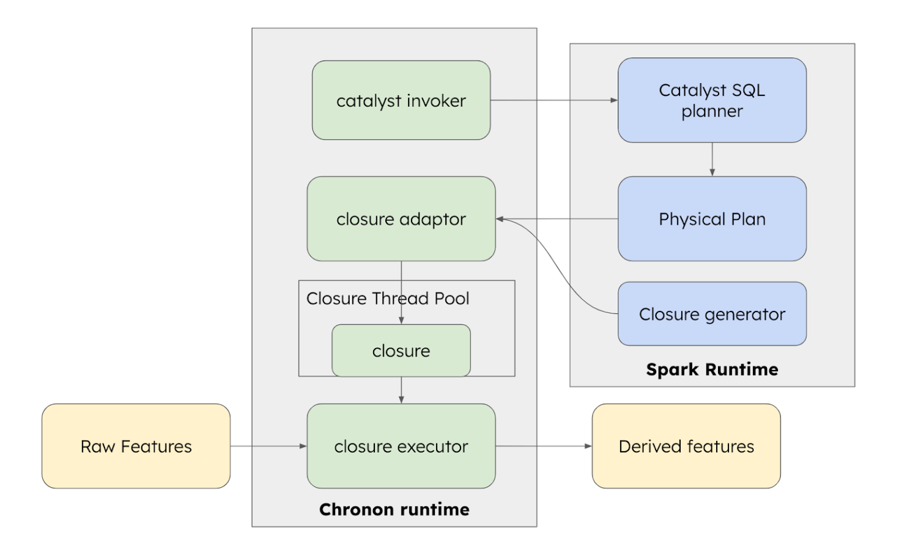

# Derived Features

While hydrating features for ML models, it is quite common to transform raw features further to make the model more effective at predicting. This is typically done to incorporate domain knowledge of a data scientist into the model. The ratio of a listing's current price and the user's historical booking price is a more helpful signal than the separate prices - while predicting relevant listings to recommend to a user.

Chronon supports this use case by allowing users to define derived features. Derived features are defined as a Spark-SQL transformations of other features. The choice of Spark SQL allows Chronon to run both online and offline compute from the same unified user API: 
- Chronon handles both offline computation in Spark/hive tables 
- Chronon handles online computation in the production service environment.

## API

We add a **derivations** parameter to Chronon **Joins**. This is of type `List[Derivation]` where `Derivation` contains two fields: 
- `name`: the name of the derived feature. This is also the output column name in offline, and feature key in the feature map response in online. 
- `expression`: the spark-sql expression that computes the derived feature from raw features. raw feature names **must** match one of the raw features defined in `join_parts` or `external_parts` of the join.  

Scenario:
- Computing the "z-score" of column x with formula `(x - x_mean) / x_std`
- Here, `x`, `x_mean` and `x_std` are all **raw features** already defined in the join. Raw features can be feature columns from any `join_parts` or `external_parts`

```python
from ai.chronon.join import Join, Derivation

Join(
    ...,
    derivations=[
        Derivation(
            name="z_score",
            expression="(x - x_mean) / x_std", # x, x_mean, x_std are all raw features
        )
    ]
)
```

## Examples

### Calculate Z-Score of a transaction amount by card

#### Description

Create a feature which is keyed by `merchant_id` and whose value is the mean of the z-scores of the `amount` associated with `card_number` over the last week used at the `merchant_id`.  This would imply that we are first aggregating by `card_number` and getting zscores for the cards and then taking those zscores, computing the mean and associating it with the `merchant_id`.


#### Input

Assume an input stream with the following fields
- `transaction_id` – the unique identifier for a transaction
- `merchant_id` – a unique identifier for the merchant associated with the transaction
- `card_number` – The card number for the transaction
- `amount` – The size of the transaction

#### GroupBy Definition 

File `group_bys/sample/card_features.py`

```python

from ai.chronon.group_by import (
   Accuracy,
   GroupBy,
   Aggregation,
   Operation,
   Window,
   TimeUnit,
)
from ai.chronon.api.ttypes import EventSource
from ai.chronon.query import Query, select

transactions_source = EventSource(
       table="namespace.transaction_table",  # TODO fill this
       topic="transactions_kafka_topic",  # TODO fill this - only necessary for online
       query=Query(selects=select("amount")),
)

v1 = GroupBy(
   sources=[transactions_source],
   keys=["merchant_id"],
   aggregations=[
       Aggregation(
           input_column="amount",
           operation=Operation.AVERAGE,
           windows=[Window(7, timeUnit=TimeUnit.DAYS)],
           buckets=["card_id"]
       ),
       Aggregation(
           input_column="amount",
           operation=Operation.VARIANCE,
           windows=[Window(7, timeUnit=TimeUnit.DAYS)],
           buckets=["card_id"]
       )
   ],
   accuracy=Accuracy.TEMPORAL
)

```

#### Join Definition 

File `joins/sample/txn_fraud.py`

```python
from group_bys.sample_team import card_features
from ai.chronon.api.ttypes import EventSource
from ai.chronon.join import Join, JoinPart, Derivation

v1 = Join(
    online=True,
    left=EventSource(
        table="namespace.your_driver_table" # which contains merchant_ids and timestamps you want backfill for
    ),
    right_parts=[JoinPart(group_by=card_features.v1),],
    derivations=[
        Derivation(
            name="txn_z_score",
            expression="array_mean(map_values(map_zip_with(sample_team_card_features_v1_amount_average_by_card_id_7d, sample_team_card_features_v1_amount_variance_by_card_id_7d, (k, mean, variance) -> (txn_value - mean)/variance)))",
        )
    ],
)
```

### Success Rate for IP Last Week

#### Description

Create a feature which is keyed by `merchant_id` and whose value is the mean of the success rates of transactions associated with a given IP over the last week used at the merchant.  This would imply that we are first aggregating by `ip` and getting the `success` rate for the IP and then taking those rates, computing the mean and associating it with the merchant.

#### Input

Assume an input stream with the following fields
- `transaction_id` – the unique identifier for a transaction
- `merchant_id` – a unique identifier for the merchant associated with the transaction
- `ip` – The IP that the transaction came from
- `success` – boolean indicating success or failure of transaction

#### GroupBy Definition 

File `group_bys/sample/merchant_features.py`

```python
from ai.chronon.group_by import (
   Accuracy,
   GroupBy,
   Aggregation,
   Operation,
   Window,
   TimeUnit,
)
from ai.chronon.api.ttypes import EventSource
from ai.chronon.query import Query, select


# TODO Add data tests
ip_successes_source = EventSource(
       table="namespace.ip_successes",
       topic="ip_successes_kafka_topic",
       query=Query(selects=select("ip", "success")),
)


# use bucketing to produce map of {ip: success_rate} and the client processes into avg
v1 = GroupBy(
   sources=[ip_successes_source],
   keys=["merchant_id"],
   aggregations=[
       Aggregation(
           input_column="success",
           operation=Operation.AVERAGE,
           windows=[Window(7, timeUnit=TimeUnit.DAYS)],
           buckets=["ip"]
       )
   ],
   accuracy=Accuracy.TEMPORAL
)
```

#### Join Definition 

File `joins/sample/txn_fraud.py`

```python
from group_bys.sample_team import merchant_features
from ai.chronon.api.ttypes import EventSource
from ai.chronon.join import Join, JoinPart, Derivation

v1 = Join(
    online=True,
    left=EventSource(
        table="namespace.your_driver_table" # which contains merchant_ids and timestamps you want backfill for
    ),
    right_parts=[JoinPart(group_by=merchant_features.v1),],
    derivations=[
        Derivation(
            name="merchant_success_rate_avg",
            expression="array_mean(map_values(sample_team_merchant_features_v1_success_avg_by_ip_7d))",
        )
    ],
)
```

## Internals

### Online Architecture 

The Spark SQL logic has to be run at service runtime (in the Fetcher) instead of outside of batch or stream processing environments, in order to handle computation across multiple `join_parts`/`external_parts` after those raw features are fetched and computed, therefore it has to be carefully designed to achieve the lowest possible latency impact.   

Since there is no direct API into Spark SQL, we create the scaffolding within Chronon runtime to pull out and manage essential pieces of Spark SQL runtime and re-assemble them to be micro service friendly.

The steps involved are
- Catalyst invoker: Take user sql fragments and convert to a sql statement and then invoke catalyst planner with the sql statement to generate an execution plan
- Closure adaptor: Clean up this execution plan and invoke the right closure generator based on the plan.
- Closure thread pool: Take the generated closure (done lazily) and cache it via a thread pool for efficient execution
- Closure executor orchestrates the input data consumptions, closure application and output data generation
  - Serialize incoming data into spark’s internal representation
  - Store the serialized input in a pre-created input buffer
  - The closure automatically is polling this buffer and write out to output buffer when transformation is done
  - We poll the output buffer and deserialize it into Chronon’s type system (we are turning the async process into a sync function execution)



### Schema Evolution

Chronon supports schema evolution for derived features. This means that you can add new derived features to your join definition without having to recompute all of your features.

During offline computation, derived features are computed at the end of the join, at the same time when the final output table is computed. When Chronon detects that a new derived feature has been added to a join, how it works currently is that it will archive the final output table and recompute it, but it will not recompute any of the intermediate tables that store computed group by data.

During online serving, derived features are computed in the `Fetcher`, instead of at `GroupByUpload` or `GroupByStreaming` time, so it naturally supports schema evolution. Derived features are also covered by logging. When derived features are added or modified, Chronon generates a new schema version similar to when group bys are added to joins, such that offline decoding can continue to work. 