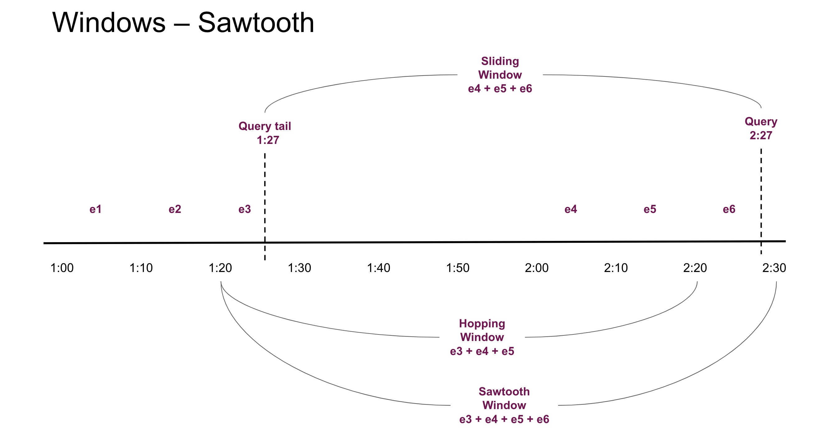

# GroupBy

*We suggest familiarizing yourself with the concepts in this document, however if you'd like you can also jump ahead to the [Examples](#examples).*

`GroupBy` is the primary API through which features are defined in Chronon. It consists of a group of `Aggregation`s (documented below) computed from a `Source` or similar `Source`s of data. 

In some cases there could also be no aggregations. This occurs when the primary key of the source dataset matches the primary key of the `GroupBy`, and means that the selected fields are to be used directly as features, with the option of row-to-row transformations (see the [Batch Entity GroupBy](#batch-entity-groupby-examples) example below).

These aggregate and non-aggregated features can be used in various ways:

- **served online**, updated in **realtime** - you can utilize the Chronon client (java/scala) to query for the aggregate values as of **now**. The client would reply with realtime updated aggregate values. This would require a *stream* of user purchases and also a warehouse (hive) *table* of historical user purchases.

- **served online**, updated at **midnight** - you can utilize the client to query for the aggregate values as of **today's midnight**. The values are only refreshed every midnight. This would require just the warehouse (hive) table of historical user purchases that receives a new partition every midnight.
  - *Note: Users can configure accuracy to be midnight or realtime*

- **standalone backfilled** - daily snapshots of aggregate values. The result is a date partitioned Hive Table where each partition contains aggregates as of that day, for each user that has a row in the largest window ending that day.

- **backfilled against another source** - see [Join](./Join.md) documentation. Most commonly used to enrich labelled data with aggregates coming from many different sources & GroupBy's at once.

**selecting the right Source for your `GroupBy`** is a crucial first step to correctly defining a `GroupBy`. 
See the [Sources](./Source.md) documentation for more info on the options and when to use each.

Often, you might want to chain together aggregations (i.e., first run `LAST` then run `SUM` on the output). 
This can be achieved by using the output of one `GroupBy` as the input to the next.

# Aggregations

## Supported aggregations

All supported aggregations are defined [here](https://github.com/airbnb/chronon/blob/main/api/thrift/api.thrift#L51).
Chronon supports powerful aggregation patterns and the section below goes into detail of the properties and behaviors
of aggregations.

## Simple Aggregations

`count`, `average`, `variance`, `min`, `max`, `top_k`, `bottom_k` are some self-describing and simple aggreagations.

## Time based Aggregations

`last`, `first`, `last_k`, `first_k` aggregations are timed aggregations and require users to define a
`GroupBy.sources[i].query.time_column` with a valid expression that produces a millisecond-granular timestamp as a Long.
All windowed aggregations require the user to define the `time_column` as well.
To accommodate common conventions, when `time_column` is not specified, but required,
Chronon will look for a `ts` column from the input source.

## Sketching Aggregations

Sketching algorithms are used to approximate the values of an exact aggregation when the aggregation itself is not
scalable. `unique_count`, `percentile`, and `histogram` aggregations are examples where getting exact value requires storing all raw
values, and hence not-scalable. `approx_unique_count`, `approx_percentile`, and `approx_histogram_k` aggregations utilize a bounded amount of
memory to estimate the value of the exact aggregation. We allow users to tune this trade-off between memory and accuracy
as a parameter to the `Aggregation`. Chronon as a policy doesn't encourage use of un-scalable aggregations.
`unique_count` and `histogram` are supported but discouraged due to lack of `scalability`.
Internally we leverage [Apache DataSketches](https://datasketches.apache.org/) library as a source of SOTA algorithms
that implement approximate aggregations with the most efficient performance.

## Reversible Aggregations

Chronon can consume a stream of db mutations to produce read-optimized aggregate views. For example - computing `max`
`purchase_price` for a `user` from a `user_purchases` source. For user `alice`, if the `max` that is being maintained so
far, gets `update`-ed and **lowered** in the db table, it would be impossible to know what the **new** `max` should be
without maintaining a complete list of all purchase prices. However this is not the case with `average` of
`purchase_price`. It is possible to store `sum` and `count` separately and adjust the `sum` and `count` when a row with
`purchase_price` gets `update`-ed, `delete`-ed or `insert`-ed.

However during online serving we asynchronously (in the background) batch-correct the aggregates by going over full
data. So even non-reversible aggregations reflect the right aggregate value **eventually** without sacrificing
scalability.

## Windowing

We support arbitrarily large windows with `HOURS`-ly or `DAYS`-ly granularity. Chronon supports what is called a
**sawtooth window**. To understand sawtooth windows we need to understand **sliding windows** and **hopping windows**.
**Un-windowed aggregation** or **life-time aggregation** is performed when `windows` argument is not specified to the
`Aggregation`.

**Sliding Windows** - a query at `2:27pm` for an aggregation defined to be `1 hour` long would span from `1:27pm` to
`2:27pm`. This type of aggregation requires us to store all raw events which is a scaling bottleneck.

**Hopping Windows** - hopping windows remedy the requirement to store all the individual events by aggregating the
events into a hop, a **fixed** time-interval. So a 1hr window with a 10 minute hops will divide the window into 6 hops
that are fixed. At `2:27pm` the hops go from `1:20 . 1:30 . 1:40 . 1:50 . 2:00 . 2:10 . 2:20`. Effectively the
aggregation range is `1:20 - 2:20`. Which is a 1 hour window but misses all the events between `2:20` and `2:27` and is
hence stale - missing most recent events. This is not accepable for machine learning use-cases.

**Sawtooth Windows** - union of sliding and hopping windows. So we get the benefit of constant (low) memory usage of
hopping windows without the loss of most recent events. Sawtooth windows will have variable window interval size - and
in this particular example we will aggregate events between `1:20` - `2:27`.



See the [Realtime Event GroupBy examples](#realtime-event-groupby-examples) for an example of windowed aggregations.

## Bucketing

Expanding on the previous example - we now want to compute `average` `purchase_price` of a `user_purchase` source, but
bucketed by `credit_card_type`. So instead of producing a single double value, bucketing produces a map of `credit_card_type` to
`average_purchase_price`.

Chronon can accept multiple `bucket` columns at once and Bucketing is specified as `GroupBy.aggregations[i].buckets`.
Bucketing always produces a map, and for online use-cases we require the bucket column to be a string. This requirement
comes from Chronon's usage of avro in the serving environment. We plan to remove this requirement at a later time.

Here's what the above example looks like modified to include buckets. Note that there are two primary changes:
1. Include the selection of the `credit_card_type` field on the source (so that we have access to the field by which we want to bucket).
2. Specify the field as a bucket key in each aggregation that we want to apply it to.

See the [Bucketed Example](#bucketed-groupby-example)

# Flattening

Chronon can extract values nested in containers and perform aggregations - over lists and maps. See details below for semantics.

## Lists as inputs 

Aggregations can also accept list columns as input. For example if we want `average` `item_price` from a `user_purchase`
source, which contains `item_prices` as a `list` of values in each row - represented by a single credit card transaction.
Simply put, `GroupBy.aggregations[i].input_column` can refer to a column name which contains lists as values. In
traditional SQL this would require an expensive `explode` command and is supported natively in `Chronon`.

## Maps as inputs 

Aggregations over columns of type 'Map<String, Value>'. For example - if you have two histograms this will allow for merging those 
histograms using - min, max, avg, sum etc. You can merge maps of any scalar values types using aggregations that operate on scalar values.
The output of aggregations with scala values on map types is another map with aggregates as values.

Limitations:
- Map key needs to be string - because avro doesn't like it any other way.
- Map aggregations cannot be coupled with bucketing for now. We will add support later.
- Aggregations need to be time independent for now - will add support for timed version later.

**NOTE: Windowing, Bucketing and Flattening can be flexibly mixed and matched.**

## Table of properties for aggregations

| aggregation              | input type      | nesting allowed? | output type       | reversible | parameters         | bounded memory |
|--------------------------|-----------------|------------------|-------------------|------------|--------------------|----------------|
| count                    | all types       | list, map        | long              | yes        |                    | yes            |
| min, max                 | primitive types | list, map        | input             | no         |                    | yes            |
| top_k, bottom_k          | primitive types | list, map        | list<input,>      | no         | k                  | yes            |
| first, last              | all types       | NO               | input             | no         |                    | yes            |
| first_k, last_k          | all types       | NO               | list<input,>      | no         | k                  | yes            |
| average                  | numeric types   | list, map        | double            | yes        |                    | yes            |
| variance, skew, kurtosis | numeric types   | list, map        | double            | no         |                    | yes            |
| histogram                | string          | list, map        | map<string, long> | yes        | k=inf              | no             |
| approx_histogram_k       | primitive types | list, map        | map<string, long> | yes        | k=inf              | yes            |
| approx_unique_count      | primitive types | list, map        | long              | no         | k=8                | yes            |
| approx_percentile        | primitive types | list, map        | list<input,>      | no         | k=128, percentiles | yes            |
| unique_count             | primitive types | list, map        | long              | no         |                    | no             |


## Accuracy

`accuracy` is a toggle that can be supplied to `GroupBy`. It can be either `SNAPSHOT` or `TEMPORAL`.
`SNAPSHOT` accuracy means that feature values are computed as of midnight only and refreshed once daily.
`TEMPORAL` accuracy means that feature values are computed in realtime while serving, and in point-in-time-correct 
fashion while backfilling.
When topic or mutationTopic is specified, we default to `TEMPORAL` otherwise `SNAPSHOT`.

**This default is usually the desired behavior, so you rarely need to worry about setting this manually.**


## Online/Offline Toggle

`online` is a toggle to specify if the pipelines necessary to maintain feature views should be scheduled. This is for 
online low-latency serving. 

```python
your_gb = GroupBy(
  ...,
  online=True
)
```
> Note: Once a groupBy is marked online, the compiler `compile.py` will prevent you from updating it. This is so that
> you don't accidentally merge a change that release modified features out-of-band with model updates. You can overwrite
> this behavior by deleting the older compiled output. Our recommendation is to create a new version `your_gb_v2` instead.


## Tuning

If you look at the parameters column in the above table - you will see `k`.
`k` for top_k, bottom_k, first_k, last_k tells Chronon to collect `k` elements.

For approx_unique_count and approx_percentile - k stands for the size of the `sketch` - the larger this is, the more
accurate and expensive to compute the results will be. Mapping between k and size for approx_unique_count is
[here](https://github.com/apache/incubator-datasketches-java/blob/main/src/main/java/org/apache/datasketches/cpc/CpcSketch.java#L180)
for approx_percentile is the first table in [here](https://datasketches.apache.org/docs/KLL/KLLAccuracyAndSize.html).
`percentiles` for `approx_percentile` is an array of doubles between 0 and 1, where you want percentiles at. (Ex: "[0.25, 0.5, 0.75]")

For histogram - k keeps the elements with top-k counts. By default we keep everything.

# Examples

The following examples are broken down by source type. We strongly suggest making sure you're using the correct source type for the feature that you want to express as a first step.

## Realtime Event GroupBy examples

This example is based on the [returns](https://github.com/airbnb/chronon/blob/main/api/py/test/sample/group_bys/quickstart/returns.py) GroupBy from the quickstart guide that performs various aggregations over the `refund_amt` column over various windows.

```python
source = Source(
    events=EventSource(
        table="data.returns", # This points to the log table with historical return events
        topic="events.returns",
        query=Query(
            selects=select("user_id","refund_amt"), # Select the fields we care about
            time_column="ts") # The event time
    ))

window_sizes = [Window(length=day, timeUnit=TimeUnit.DAYS) for day in [3, 14, 30]] # Define some window sizes to use below

v1 = GroupBy(
    sources=[source],
    keys=["user_id"], # We are aggregating by user
    online=True,
    aggregations=[Aggregation(
            input_column="refund_amt",
            operation=Operation.SUM,
            windows=window_sizes
        ), # The sum of purchases prices in various windows
        Aggregation(
            input_column="refund_amt",
            operation=Operation.COUNT,
            windows=window_sizes
        ), # The count of purchases in various windows
        Aggregation(
            input_column="refund_amt",
            operation=Operation.AVERAGE,
            windows=window_sizes
        ),
        Aggregation(
            input_column="refund_amt",
            operation=Operation.LAST_K(2),
        ),
    ],
)
```

## Bucketed GroupBy Example

In this example we take the [Purchases GroupBy](https://github.com/airbnb/chronon/blob/main/api/py/test/sample/group_bys/quickstart/purchases.py) from the Quickstart tutorial and modify it to include buckets based on a hypothetical `"credit_card_type"` column.

```python
source = Source(
    events=EventSource(
        table="data.purchases",
        query=Query(
            selects=select("user_id","purchase_price","credit_card_type"), # Now we also select the `credit card type` column
            time_column="ts")
    ))

window_sizes = [Window(length=day, timeUnit=TimeUnit.DAYS) for day in [3, 14, 30]]

v1 = GroupBy(
    sources=[source],
    keys=["user_id"],
    online=True,
    aggregations=[Aggregation(
            input_column="purchase_price",
            operation=Operation.SUM,
            windows=window_sizes,
            buckets=["credit_card_type"] # Here we use the`credit_card_type` column as the bucket column
        ),
        Aggregation(
            input_column="purchase_price",
            operation=Operation.COUNT,
            windows=window_sizes,
            buckets=["credit_card_type"]
        ),
        Aggregation(
            input_column="purchase_price",
            operation=Operation.AVERAGE,
            windows=window_sizes,
            buckets=["credit_card_type"]
        ),
        Aggregation(
            input_column="purchase_price",
            operation=Operation.LAST_K(10),
            buckets=["credit_card_type"]
        ),
    ],
)
```


## Simple Batch Event GroupBy examples

Example GroupBy with windowed aggregations. Taken from [purchases.py](https://github.com/airbnb/chronon/blob/main/api/py/test/sample/group_bys/quickstart/purchases.py).

Important things to note about this case relative to the streaming GroupBy:
* The default accuracy here is `SNAPSHOT` meaning that updates to the online KV store only happen in batch, and also backfills will be midnight accurate rather than intra day accurate.
* As such, we do not need to provide a time column, midnight boundaries are used as the time along which feature values are updated. For example, a 30 day window computed using this GroupBy will get computed as of the prior midnight boundary for a requested timestamp, rather than the precise millisecond, for the purpose of online/offline consistency.

```python
source = Source(
    events=EventSource(
        table="data.purchases", # This points to the log table with historical purchase events
        query=Query(
                selects=select("user_id","purchase_price"), # Select the fields we care about
            )
    ))

window_sizes = [Window(length=day, timeUnit=TimeUnit.DAYS) for day in [3, 14, 30]] # Define some window sizes to use below

v1 = GroupBy(
    sources=[source],
    keys=["user_id"], # We are aggregating by user
    online=True,
    aggregations=[Aggregation(
            input_column="purchase_price",
            operation=Operation.SUM,
            windows=window_sizes
        ), # The sum of purchases prices in various windows
        Aggregation(
            input_column="purchase_price",
            operation=Operation.COUNT,
            windows=window_sizes
        ), # The count of purchases in various windows
        Aggregation(
            input_column="purchase_price",
            operation=Operation.AVERAGE,
            windows=window_sizes
        ), # The average purchases by user in various windows
        Aggregation(
            input_column="purchase_price",
            operation=Operation.LAST_K(10),
        ),
    ],
)
```

### Batch Entity GroupBy examples

This is taken from the [Users GroupBy](https://github.com/airbnb/chronon/blob/main/api/py/test/sample/group_bys/quickstart/users.py) from the quickstart tutorial.


```python
"""
The primary key for this GroupBy is the same as the primary key of the source table. Therefore,
it doesn't perform any aggregation, but just extracts user fields as features.
"""

source = Source(
    entities=EntitySource(
        snapshotTable="data.users", # This points to a table that contains daily snapshots of the entire product catalog
        query=Query(
            selects=select("user_id","account_created_ds","email_verified"), # Select the fields we care about
        )
    ))

v1 = GroupBy(
    sources=[source],
    keys=["user_id"], # Primary key is the same as the primary key for the source table
    aggregations=None, # In this case, there are no aggregations or windows to define
    online=True,
) 
```
