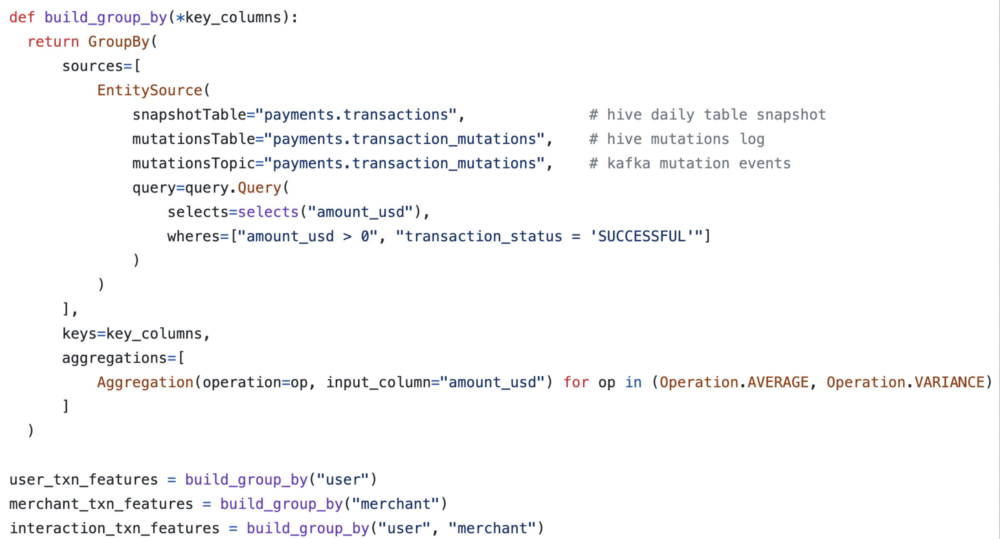

# 2. Fluent API for Chronon

## Context
Our API to create objects currently takes all arguments at once. We use this style to create objects such as Source, GroupBy, Join etc. *We are essentially exposing functions with 10s of arguments.* This could lead to cognitive burden for the author and the reader.

This doc outlines a fluent API inspired in-part by [PRQL](https://prql-lang.org/). Example below.

```sql
from invoices
filter invoice_date >= @1970-01-16
filter income > 1
group customer_id (
  aggregate {
    average total,
    sum_income = sum income,
    ct = count total,
  }
)
```
--- 

## Goals

- Terse API to author objects supported by Chronon, specially Source, GroupBy and Join.
- Pure syntax sugar - and de-sugare-able into the base Chronon object easily.

## Non-Goals
- Modify the expression language (spark SQL fragments) in any way.


## Why not directly adopt PRQL?

Like SQL, PRQL doesn't support the following features that Chronon supports
- notion of source types - fact, dim, scd 
- first-class time based windowing
- advanced aggregation based on buckets, auto-exploding of lists prior aggregation and auto-merging of maps during aggregation.
- ML primitives such as labels and models (bigquery sql is an exception)
- helper functions - for eg., that generate multiple groupBys given a key set as an argument. This is very common in Chronon. See example below.
- In Chronon the select clause is exclusively reserved for projections. SQL allows you to combine projection and aggregations into the same select clause.



## Approach

We outline examples to build `Source`, `GroupBy` and a `Join` using a fluent API. Subsequent sections have examples for each of the object type.

### Building Sources

```python
From.fact(table, topic).in_range(start, end) 
    .with_timestamp("ts") # optional, goes anywhere - defaults to ts
    .where(clause1, clause2) # can use derive aliases in clause 1 or 2
    .select(col1=expr1, col2=expr2)
```


#### Basic Source - without any transformations.

In sql the very first statement that runs is the from clause. The root of the API is `From` - which describes the raw source without any transformations whatsoever.

`From` has 5 methods: 
- fact(table, topic), 
- dim(snapshot_table, mutation_table, mutation_topic),
- scd(table, topic), 
- join(another_join_object)
- staging_query(staging_query_object) + as_fact() or as_dim() or as_scd() 


> Chronon also allows connecting a join as a source to another groupBy - referred to as *chaining*. 

> We also allow directly passing *StagingQueries* when annotated with the data model using `.as_fact()`, `.as_dim()` or `.as_scd()`.

At this point, we have a class that defines which tables and topics to read, and the *model* of data such as fact, dim or scd. 

#### Filtered Source - applying where clause

In sql the second statement that runs, when present is the *where* clause. PRQL chooses to call this filter, we retain SQL's where. Where has a more precise connotation than filter (where = filter-in, where + not = filter out). 

```python
.where(clause1, clause2)
```

Clauses are joined together with an `AND` - similar to the base Chronon API.

#### Why we won't need `derive` clauses

Very often you want transform a table column a certain way and re-use it for filtering and the select clauses. PRQL, supports a `derive` method, that *substitutes* an expression into select and where clauses that are immediately downstream. 

Since we have direct access to python - we can instead directly use python variables and f-strings to achieve more powerful substitutions.

#### Select clause

As mentioned, in Chronon the select clause is exclusively reserved for projections. Works same as before.


#### Group By
At this point we have a fully formed source we can now support union, groupBy and join on the fully formed source

```python
    
src
    .groupBy(key1, key2)
    .defaultWindows([1d, 7d])
    .agg(
        last_k(col1, k = 10, windows = [1d, 7d], buckets = [bucket1, bucket2]),
        approx_uniq(col2, lg_k = 20),
        last(col3, buckets = [bucket1, bucket2])
    )
    .temporalAccuracy() # optional
    .derive(alias1 = expr1, alias2 = expr2)
```