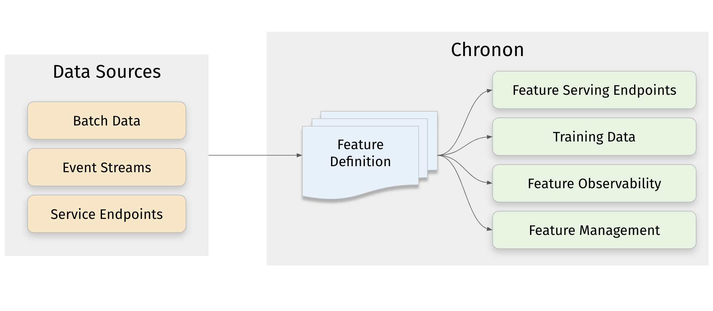

# What is Chronon?

Chronon is an open source end-to-end feature platform that allows Machine Learning (ML) teams to easily build, deploy, manage and monitor data pipelines for machine learning.

It's currently used to power all major ML applications within Airbnb, as well as major use cases at Stripe. Airbnb and Stripe jointly manage and maintain the project, and welcome your usage and contributions!




# Key Features

* **Consume data from a variety of Sources** - Event streams, batch warehouse tables, production databases, change data streams, service endpoints, as well as data available in the request context can all be used as Chronon inputs.
* **Easily define transformations and aggregations** - Raw data ingested from sources can be transformed into useful features using a flexible library.
* **Produce results both online and offline contexts** - Online, as scalable low-latency end-points for feature serving, or offline as hive tables to power model training and evaluation flows.
* **Real-time and batch support with online/offline consistency** - Chronon not only supports realtime and batch updates to the online KV store used to power production inference, but it also provides temporally accurate backfills in the offline context. This means that training data is always consistent with production inference data.
* **Powerful python API** - Define your features in a simple and intuitive python interface, and let Chronon abstract away the complexity of computation and serving.
* **Automated feature monitoring** - Auto-generate monitoring pipelines to understand training data quality, measure training-serving skew and monitor feature drift.

## Example

Here is a code example taken from the [Quickstart Tutorial](./Tutorial.md) showing what a simple Chronon GroupBy looks like. 

This definition starts with purchase events as the raw input source, and creates user level features by aggregating the number of purchases and the purchase value in various windows, using various aggregations. This single definition can be used to automatically create offline datasets, feature serving end-points and data quality monitoring pipelines.

```python
"""
This GroupBy aggregates metrics about a user's previous purchases in various windows.
"""

# This source is raw purchase events. Every time a user makes a purchase, it will be one entry in this source.
source = Source(
    events=EventSource(
        table="data.purchases", # This points to the log table in the warehouse with historical purchase events, updated in batch daily
        topic= "events/purchases", # The streaming source topic that can be listened to for realtime events
        query=Query(
            selects=select(
                user="user_id",
                price="purchase_price * (1 - merchant_fee_percent/100)"
            ), # Select the fields we care about
            time_column="ts"  # The event time
        ) 
    )
)

window_sizes = [Window(length=day, timeUnit=TimeUnit.DAYS) for day in [3, 14, 30]] # Define some window sizes to use below

v1 = GroupBy(
    sources=[source],
    keys=["user_id"], # We are aggregating by user
    online=True,
    aggregations=[Aggregation(
            input_column="price",
            operation=Operation.SUM,
            windows=window_sizes
        ), # The sum of purchases prices
        Aggregation(
            input_column="price",
            operation=Operation.COUNT,
            windows=window_sizes
        ), # The count of purchases
        Aggregation(
            input_column="price",
            operation=Operation.AVERAGE,
            windows=window_sizes
        ), # The average purchases
        Aggregation(
            input_column="price",
            operation=Operation.LAST_K(10),
        ), # The last 10 purchase prices, collected into a list
    ], # All aggregations are performed over the window_sizes defined above
)
```

To run this and other features and see the complete flow from generating training data to online serving, continue along to the [Quickstart Tutorial](./Tutorial.md), or for more documentation on how to author and use features, see the [Creating Training Data](https://chronon.ai/authoring_features/GroupBy.html) section.
