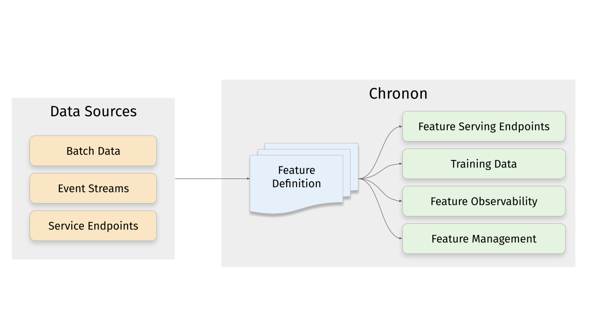

.. Chronon documentation master file, created by
   sphinx-quickstart on Tue Oct 18 14:20:28 2022.
   You can adapt this file completely to your liking, but it should at least
   contain the root `toctree` directive.

.. toctree::
   :maxdepth: 2
   :hidden:
   :caption: Introduction

   getting_started/Introduction
   getting_started/Tutorial

.. toctree::
   :maxdepth: 2
   :hidden:
   :caption: Creating Training data

   authoring_features/GroupBy
   authoring_features/Join
   authoring_features/ChainingFeatures
   authoring_features/Source
   authoring_features/StagingQuery
   authoring_features/DerivedFeatures
   authoring_features/Bootstrap

.. toctree::
   :maxdepth: 2
   :hidden:
   :caption: Setup

   setup/Components
   setup/Data_Integration
   setup/Developer_Setup
   setup/Online_Integration
   setup/Orchestration
   setup/Flink

.. toctree::
   :maxdepth: 2
   :hidden:
   :caption: Test, Serve & Monitor

   test_deploy_serve/Test
   test_deploy_serve/Deploy
   test_deploy_serve/Serve
   test_deploy_serve/Online_Offline_Consistency

.. toctree::
   :maxdepth: 2
   :hidden:
   :caption: More References

   Python_API
   Tiled_Architecture
   Code_Guidelines
   Kaggle_Outbrain

What is Chronon?
=====================
Chronon is a feature engineering framework is being used to power Machine Learning in every 
organization within Airbnb. Chronon makes developing production-grade, 
features at scale very easy. 

With Chronon you can generate training data, serve features, monitor feature quality 
and manage features with a unified feature definition.

* **Consume data from a variety of Sources** - event streams, DB table snapshots, change data streams, service endpoints and warehouse tables modeled as either slowly changing dimensions, fact or dimension tables
* **Produce results both online and offline contexts** - Online, as scalable low-latency end-points for feature serving, or offline as hive tables, for generating training data.
* **Real-time or batch accuracy** - You can configure the result to be either *Temporal* or *Snapshot* accurate. Temporal refers to updating feature values in real-time in online context and producing point-in-time correct features in the offline context. Snapshot accuracy refers to features being updated once a day at midnight.
* **Backfill training sets from raw data** - without having to wait for months to accumulate feature logs to train your model.
* **Powerful python API** - data source types, freshness and contexts are API level abstractions that you compose with intuitive SQL primitives like group-by, join, select etc., with powerful enhancements.
* **Automated feature monitoring** - auto-generate monitoring pipelines to understand training data quality, measure training-serving skew and monitor feature drift.

Being able to flexibly compose these concepts to describe data processing is what makes feature engineering in Chronon productive.

Example
=====================
This is what a simple Chronon Group-By looks like. This definition is used to automatically 
create offline datasets, feature serving end-points and data quality monitoring pipelines.

.. code-block:: python

    # same definition creates offline datasets and online end-points
    view_features = GroupBy(
       sources=[
           EventSource(
               # apply the transform on offline and streaming data
               table="user_activity.user_views_table",
               topic="user_views_stream",
               query=query.Query(
                   # specify any spark sql expression fragments
                   # built-in functions, UDFs, arithmetic operations, inline-lambdas, struct types etc.
                   selects={
                       "view": "if(context['activity_type'] = 'item_view', 1 , 0)",
                   },
                   wheres=["user != null"]
               ))
       ],
       # composite keys
       keys=["user", "item"],
       aggregations=[
           Aggregation(
               operation=Operation.COUNT,
               # automatically explode aggregation list type input columns
               input_column=view,
               #multiple windows for the same input
               windows=[Window(length=5, timeUnit=TimeUnit.HOURS)]),
       ],
       # toggle between fresh vs daily updated features
       accuracy=Accuracy.TEMPORAL,
    )

Getting Started
=====================
If you wish to work in an existing chronon repo, simply run the command below.

.. code-block:: bash

   pip install chronon-ai

If you wish to setup a chronon repo, for ease of orchestration, we recommend that you
run the command below in an airflow repository.

.. code-block:: bash

   curl -s https://chronon.ai/init.sh | $SHELL

Once you edit the spark_submit_path line in :code:`./chronon/teams.json` you will be able to run offline jobs.
Find more details in the Getting Started section.