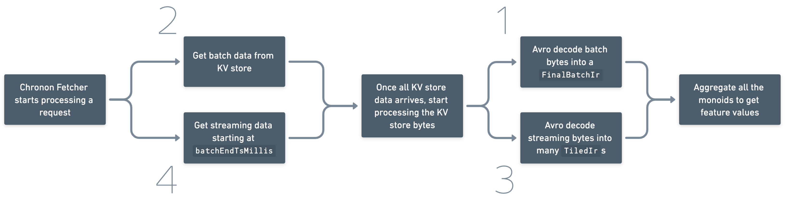
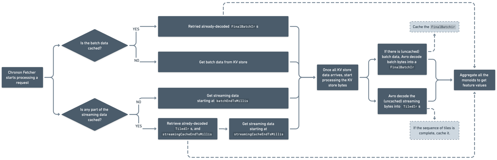

# CHIP-1 – Online IR and GetRequest Caching
_By Caio Camatta (Stripe) | Last modified Jan 3, 2024_

This CHIP introduces IR caching in Chronon's online/Fetcher side. We're currently trying out caching at Stripe and will update this doc with benchmarks and findings.

## Motivation

The primary goal of this CHIP is to decrease Chronon feature serving latency and reduce RPS to KV stores.

During our latest load tests, we observed that our feature serving app spends 20% of the time performing GET requests and the remaining 80% processing that data and constructing the GroupBy responses. A significant amount of the work necessary to process the data comes from `AvroCodec.decode` (the function that decodes bytes stored in the KV store). This function takes up 28% of total CPU time: ~21.5% is spent decoding batch IRs, and ~6.5% decoding tile IRs.

We hope to decrease serving latency by

- Caching the work to decode batch bytes into batch IRs (up to ~21.5% of CPU).
- Caching the work to decode streaming bytes into tile IRs (up to ~6.5% of CPU).
- Caching KV store requests (up to ~20% of request latency).

This CHIP does not discuss optimizing to the un-tiled version of Chronon, which is the default. Only the batch caching portion of this CHIP applies to that version. (At Stripe, we use a tiled implementation of Chronon, which we are open-sourcing [#523](https://github.com/airbnb/chronon/pull/523), [#531](https://github.com/airbnb/chronon/pull/523).)

## Proposed Change

Here's a diagram of how the Chronon Fetcher works currently.

_Simplified Chronon Fetcher before proposed changes. The numbers represent what we will change in each Step of the Implementation ("2" = "Step 2")_.

We will be caching four different operations:
 - Performing streaming GET requests
 - Performing batch GET requests
 - Avro decoding of streaming bytes
 - Avro decoding of batch bytes

To do that, I’m proposing we use two types of Caffeine caches to store:

- Key: batch get requests → Value: batch IRs
- Key: streaming get requests → Value: streaming IRs

After this CHIP is implemented, the Fetcher would work the following way: 

_Simplified Chronon Fetcher after this CHIP._

For reference, here's how data is currently stored in the KV store on the tiled version of Chronon:

_Data stored in the KV store._

The caches will be configured on a per-GroupBy basis, i.e. two caches per GroupBy. This allows us to enable caching only for features with very skewed access patterns (when the top few keys correspond to a significant percentage of traffic). See _Rejected Alternative #4_ and _UX Considerations_ for more details.

Caching will be an opt-in feature that can be enabled by Chronon developers.

Most of the code changes are in [FetcherBase.scala](https://github.com/airbnb/chronon/blob/main/online/src/main/scala/ai/chronon/online/FetcherBase.scala).

### Batch Caching Details

This cache will consist of:

- Key: a combination of (`batchDataset`, `keyBytes`, `batchEndTsMillis`, "latest batch data landing time").
- Value: either `FinalBatchIr` (for the [temporal accuracy code path](https://github.com/airbnb/chronon/blob/f786ab9ce9314bc09495499765cfaddd0f4ef5a7/online/src/main/scala/ai/chronon/online/FetcherBase.scala#L83C4-L83C4)) or `Map[String, AnyRef]` (for the [no-agg and snapshot accuracy code path](https://github.com/airbnb/chronon/blob/f786ab9ce9314bc09495499765cfaddd0f4ef5a7/online/src/main/scala/ai/chronon/online/FetcherBase.scala#L79)).

#### Populating and using the cache

Every time `FetcherBase.toBatchIr` is called, we check if the result is already cached. If it’s not, we run the function and store it in cache. Caffeine takes care of storing only the most used values.

Then, before making a batch GET request, we check if it is already in cache. If so, we don’t make the KV store request.

#### Keeping GroupByServingInfo up-to-date

`GroupByServingInfo` contains information about a GroupBy, such as how much batch data is available (i.e. `batchEndTsMillis`). When the Chronon Fetcher receives a request, it needs to know in advance how much batch data is available so it can split the window into batch and streaming -- `GroupByServingInfo` is used for that.

Currently, every time we perform a batch KV store request, we also get back the latest `batchEndTsMillis`. Then, in `FetcherBase`, we update the serving info if the new `batchEndTsMillis` is ahead of the current one stored in memory (i.e. new batch data has landed!) – see `updateServingInfo`.

Once we start caching batch `GetRequest`s, it could happen that no batch KV store requests are made, and we never receive the updated `batchEndTsMillis` after batch data lands (or delay it). To address that, the following change is necessary: we will call `MetadataStore.refresh` once for every `FetcherBase.constructGroupByResponse` call. 

In practice, this means that `groupByServingInfo` will be updated at most 8 seconds after new batch data has landed. When new batch data lands, the `groupByServingInfo.batchEndTsMillis` will be updated and we will start using the new batch data right away.

#### Cache invalidation (edge case)

The "latest batch data landing time" used in keys is essential for cache invalidation.

The `batchEndTsMillis` portion of the key indicates the timestamp until which we have batch data. However, we also need to know when that batch data landed. If a user re-runs their `GroupByUpload` airflow task, the `batchEndTsMillis` wouldn’t change but the underlying data could. So, we keep track of the time at which your batch data job landed.

We'll also add `batchDataLandingTime` to `GroupByServingInfo` and have it be populated by batch jobs.

### Streaming Caching Details

(This only applies to `GroupBys` that are scheduled online / use `TEMPORAL` accuracy.)

This cache will consist of:

- Key: a combination of (`streamingDataset`, `keyBytes`, `batchEndTsMillis`).
- Value: (`TiledIr`, "`streamingCacheEndTsMillis`")

#### Populating and using the cache

When a streaming GetRequest is performed, it may return a number of tiles. For example, a request for the range [0:00, 3:00) could return three tiles, [0:00, 1:00) + [1:00, 2:00) + [2:00, 3:00). Here, `batchEndTsMillis` = 0:00. Each tile contains a field called `isComplete`, which indicates whether that tile is complete. This field is set to True when the event-processing side of Chronon (Flink, in our case) decides that a tile is completed and will no longer be changed.

If consecutive tiles starting from `batchEndTsMillis` are all completed, then we combine them into a single TiledIr and cache them with `streamingCacheEndTsMillis` set to the end time of the last cached tile. Caffeine takes care of storing only the most used values.

- Example: if  [0:00, 1:00) and [1:00, 2:00) are both complete, we will cache a single TiledIr for the range [0:00, 2:00) with `streamingCacheEndTsMillis` = 2:00.

- GroupBys with windows shorter than one day should be handled slightly differently so caching works.

Then, when creating a streaming GetRequest, we check if that (`streamingDataset`, `keyBytes`, ``batchEndTsMillis``) is in cache. If so, we modify the `batchEndTsMillis` of the outgoing GetRequest to be `streamingCacheEndTsMillis`. So, for example, if it’s 17:00 UTC, and your cache contains streaming data for [0:00, 13:00), we modify the `GetRequest` to fetch only [13:00, ...). This reduces the number of tiles that need to be fetched.

Cache invalidation is not necessary on the online side. If a tile is marked as complete, it is not expected to change. Cached values would only need to be invalidated if you changed your GroupBy definition and restarted Flink without state. If that’s the case, you would also need to restart your feature serving app which would then restart the cache.

#### Gaps aren’t cached

If, for whatever reason, there are any gaps in completed tiles during the day, caching won’t occur. For example, if a `GetRequest` returns three tiles, [0:00, 1:00), [1:00, 2:00), [2:00, 3:00), and only  [1:00, 2:00) is completed, we won’t cache nor set `streamingCacheEndTsMillis` to 2:00.

### UX Considerations

(We are curious to hear others’ opinions on UX.)

There are some UX aspects to consider if we are configuring caches on a per-GroupBy basis, as we certainly don’t want every user to have to think about caching when creating features.

First, there should be a default cache size. This size might be 0, i.e. disabled by default, or something small (say, 50 MB). New users, or users without stringent latency requirements will never have to think about caching.

For more advanced users, with stringent latency requirements, we (the developers) can help them configure/enable caching.
- For starters, this could be done via a parameter in a GroupBy’s `customJson`, e.g. `fetcher_cache_size` = 100 MB or 10,000 elements. It could also be simplified to a boolean, e.g. `enable_fetcher_caching`. This can potentially become part of the GroupBy API later on.
- To correctly size a cache and estimate the hit rate, we need knowledge of the access patterns. So we will work with users to figure out what makes sense.

## Implementation

Within Stripe, we are implementing and testing these changes incrementally so we can measure the effect of each of them. Once we have developed and tested all the different Steps listed here, and assuming the CHIP is accepted, we will open source the changes as two PRs (one for batch IR caching, and one for tile IR caching). Chronon users can then opt-in to one or both the caching strategies.

### Step 0: Add caching library (Caffeine)

For the caching library, we'll use Caffeine. It's a rewrite of Google’s Guava, and it's very popular.

In this step, we add Caffeine as a dependency and set up:

- A `Cache` class that can be used for all the following steps
- Cache metrics
- Unit tests

The size of the cache should ideally be set in terms of maximum memory usage (e.g., 2GB) instead of in terms of maximum number of elements. Estimating memory usage is a [tricky problem](https://stackoverflow.com/questions/258120/what-is-the-memory-consumption-of-an-object-in-java?noredirect=1&lq=1) and [not something Caffeine provides out-of-the-box](https://stackoverflow.com/questions/73139235/how-to-set-maximum-memory-usage-in-caffeine#comment129179258_73139235). To achieve that, we can use the [Java Instrumentation library](https://docs.oracle.com/javase/8/docs/api/java/lang/instrument/package-summary.html) or [JAMM](https://github.com/jbellis/jamm), a library which is [commonly used alongside Caffeine](https://openjdk.org/jeps/8249196#:~:text=JAMM%20is%20routinely%20used%20with%20Caffeine%20to%20weigh%20the%20cache%20entries). If that proves difficult and we must stick with a maximum number of elements, the creator of Caffeine suggests sizing by [guessing, measuring, and repeating](https://stackoverflow.com/questions/39503105/caffeine-how-to-come-up-with-an-appropriate-cache-size#:~:text=best%20answer%20for%20sizing%20is%20to%20guess%2C%20measure%2C%20and%20repeat).

### Step 1: BatchIr Caching

We start by caching the conversion from `batchBytes` to `FinalBatchIr` (the [toBatchIr function in FetcherBase](https://github.com/airbnb/chronon/blob/main/online/src/main/scala/ai/chronon/online/FetcherBase.scala#L102)) and `Map[String, AnyRef]`.

To make testing easier, we'll disable this feature by default and enable it via Java Args.

Results: I tested this in production and saw a 22-35% decrease in serving latency depending on configuration. I used a realistic load test, served 10-15 GroupBys which used 4 different entity key types (some had skewed a access pattern, some didn't), a 20K-element cache shared across all GroupBys.

### Step 2: Batch GetRequest Caching

In this step, we will:

- Add logic to stop sending batch GET requests when that request’s data is available in cache.
  - Detail: in code, we will 1) check if the `GetRequest` is cached 2) if so, store it in a variable in memory so it’s not lost due to race conditions 3) make any necessary, uncached get requests 4) use the cached values
- Start using `MetadataStore.refresh` so `GroupByInfoParsed` is kept up-to-date regardless of whether we are querying the batch KV store.

For the first point, in code, we will 1) check if the `GetRequest` is cached 2) if so, store it in a variable in memory so it's not lost due to race conditions 3) make any necessary, uncached get requests 4) use the cached values.

We won't worry add about edge case invalidation just yet (the aforementioned "latest batch data landing time" stuff).

Results: will add

### Step 3: `TiledIr` Caching

The second step is caching [tile bytes to TiledIr](https://github.com/airbnb/chronon/blob/main/online/src/main/scala/ai/chronon/online/TileCodec.scala#L77C67-L77C67). This is only possible if the tile bytes contain information about whether a tile is complete (i.e. it won’t be updated anymore). The Flink side marks tiles as complete.

This cache can be "monoid-aware". Instead of storing multiple consecutive tiles for a given time range, we combine the tiles and store a single, larger tile in memory. For example, we combine two tiles, [0, 1) and [1, 2), into one, [0, 2).

Results: will add

### Step 4: Streaming GetRequest Caching.

Add the rest of the logic described in "Streaming Caching Details" so that the `batchEndTsMillis` in the outgoing GetRequest is modified and the KV store ends up fetching fewer tiles.

Results: will add

### Step 5: Final Polishing
The final step is to
- Add memory-based cache size
- Handle edge cases; add batchDataLandingTime stuff.
- Add per-GroupBy caching (we might actually do this earlier on)

## Rejected Alternatives

### Rejected Alternative #1: Defer `GetRequest` caching to specific KV Stores

In the Proposed Changes, I am suggesting that we add the logic for caching `GetRequest`s within Chronon. This alternative would be to
- Cache Avro conversions from batch bytes to `FinalBatchIr`/`Map[String, AnyRef]` streaming bytes to `TiledIr`s in Chronon.
- Do not cache anything related to `GetRequest`s in Chronon.

The advantage of this alternative is that it keeps the changes to FetcherBase very simple.

The issue is that caching Avro conversions may save us a good amount of CPU (say, up to 28% in our example at the top of the document), but it wouldn’t save any time fetching from the KV stores. Additionally, Chronon contains the knowledge of whether a tile/batch ir can be cached, so it makes sense for it to make the decision of whether to cache or not.

Ultimately, I’m rejecting this alternative because the Proposed Changes will cache GetRequests in a way that is applicable to everyone regardless of KV store. If Chronon developers want, they could still add their own layer of caching in their KV store.

### Rejected Alternative #2: Use a single cache for both batch and streaming

In the Proposed Changes, the idea is to have two separate caches, one for streaming and one for batching. This allows developers to separately tune them based on their specific benchmarks.

The alternative would be to use a single cache with `GetRequest`s as keys (or something similar) and `Avro.GenericRecord`s as values (or something similar).

This alternative is conceptually simpler – one cache instead of two –  but

- It is not as tuneable. For example, for some users, the batch fetching and decoding work may take up the majority of time, so they would likely want their batch cache to be larger than their streaming cache.

- We would still need to parse `Avro.GenericRecord` into `FinalBatchIr` and `TiledIr`. This doesn’t take up a huge amount of time but is worth noting.

Personally, I am still on the fence about this one, but leaning towards two caches. Opinions are very welcome.

### Rejected Alternative #3: Use one `GetRequest` per tile instead of one per `GroupBy` for streaming `GetRequest` caching

Currently, we send one GetRequest to our KV store and receive back any number of tiles. For example, a request for the range [0:00, 3:00) could return three tiles, [0:00, 1:00) + [1:00, 2:00) + [2:00, 3:00).

This is a problem because caching the GetRequest would mean caching all the streaming data, and streaming data changes frequently. In the Proposed Changes, we get around this by adjusting the `batchEndTsMillis` of the GetRequest to be the latest batched tile. That way, if we need [0:00, 3:00) and [0:00, 1:00) + [1:00, 2:00) are cached, we change `batchEndTsMillis` to 2:00 so that only the latest tiles are fetched.

The alternative rejected here is to refactor FetcherBase to instead create one streaming GetRequest per tile. That way, if a GetRequest is cached, we just don’t send it to the KVstore.

I am rejecting this alternative because it requires unnecessary refactoring of the FetcherBase and potentially also Chronon developer’s KV store implementation.

### Rejected Alternative #4: Share caches across GroupBys

Instead of two caches (streaming and batch) per GroupBy, we could have two caches for the whole application.

This approach is simpler, but not optimal. Certain GroupBys require caching more than others. For example, imagine you have a cache of 10,000 elements and two GroupBys with different keys:

- GroupBy A. On a regular day, the top 10,000 keys correspond to 90% of traffic
- GroupBy B. On a regular day, the top 10,000 keys correspond to 1% of traffic

It likely makes sense to cache A but not B. A shared cache would be less effective.

## New or Changed Public Interfaces

None

## Migration Plan and Compatibility

Online caching is an optional feature that is disabled by default. Chronon users who need to decrease serving latency can enable caching. No migration is required.

Before enabling caching in production, user/developers should decide on a size for the cache based on their deployment. Setting the size too high may result in significantly increased GC time.
