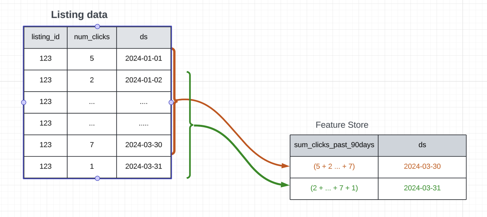
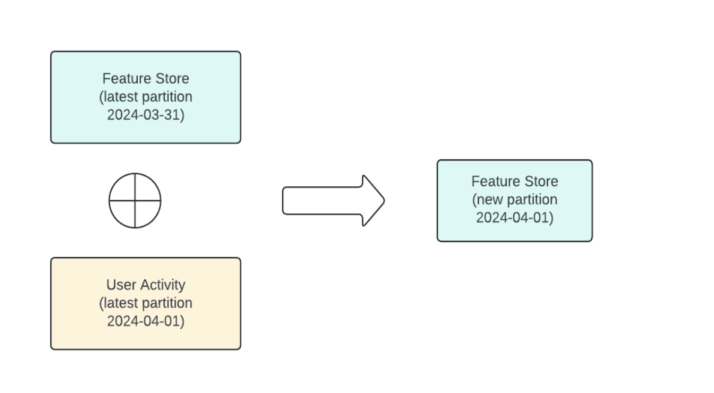
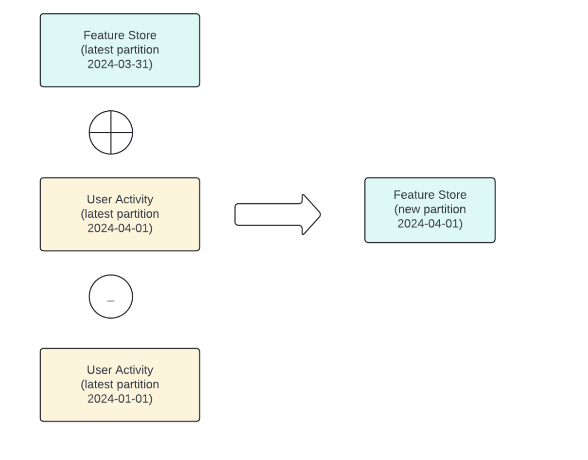

# Motivation

Chronon reads data partitions based on window sizes to compute features for event sources. For example

sum_clicks_past_30days          ←  30 day window
count_visits_past_90days         ←  90 day window

When computing aggregations, one of the major time taking tasks is reading data from disk. If a feature needs 90 days lookback, Chronon reads 90 days worth of data to compute. When this feature is computed in production everyday, consecutive days have 89 partitions in common.




This CHIP is to add support for incremental aggregation which will avoid reading 89 common partitions between consecutive days and take advantage of previous day’s computation in feature store.


# Usecases
## Case 1 : Unwindowed deletable


> Eg:  how many listings purchased by the user since signup.

These features are not windowed, which means the feature calculation happens over the lifetime.



## Case 2 : Windowed deletable
These features are windowed and has a inverse operator

> Eg: Number of listings(Count Aggregation) purchased by the user in the past 90 days



```python
GroupBy(
    sources=[table_name],
    keys=["key_col1", "key_col2"],
    aggregations=[
        Aggregation(
            input_column="inp_col",
            operation=Operation.COUNT,
            windows=[
                Window(length=3, timeUnit=TimeUnit.DAYS),
                Window(length=10, timeUnit=TimeUnit.DAYS)

            ]
        )],
    accuracy=Accuracy.SNAPSHOT
)
```
To compute above groupBy incrementally
* Read the output table from groupby to get previous day’s aggregated values
* Read _day 0_ to add the latest activity
* Read user activity on day 4, day 11 to delete the unwanted user data

## Case 3: Windowed non-deletable

These features are windowed and does not have an inverse operator


> Eg: What is the max purchase price by the user in the past 30 days

For non-deletable operators, we will go with the current behavior of Chronon where we load all the data/partitions needed to compute feature.

# Implementation

## API Changes 

Add `incremental=True` if the feature compute needs to happen in incremental way in GroupBy API

```python
GroupBy(
    sources=[table_name],
    keys=["key_col1", "key_col2"],
    aggregations=[....],
    incremental_agg=True,
    accuracy=Accuracy.SNAPSHOT
)
```
Need thrift changes for the flag

## Phase 1

Implement incremental aggregation for a groupby where all aggregations are invertible

### Step 1 : Changes to Data Scanning

Instead of reading all the partitions of the source, read only the following

* Latest source data partition
* Latest GroupBy output partition
* Partitions needed to delete the unwanted data. These are obtained from length of window from current date.
   * For example, if the window is 30 days, 31st date partition is read.

```scala
def renderDataSourceQuery()
```

### Step 2 : Changes to Aggregator

* `delete` function is implemented for deletable aggregations
