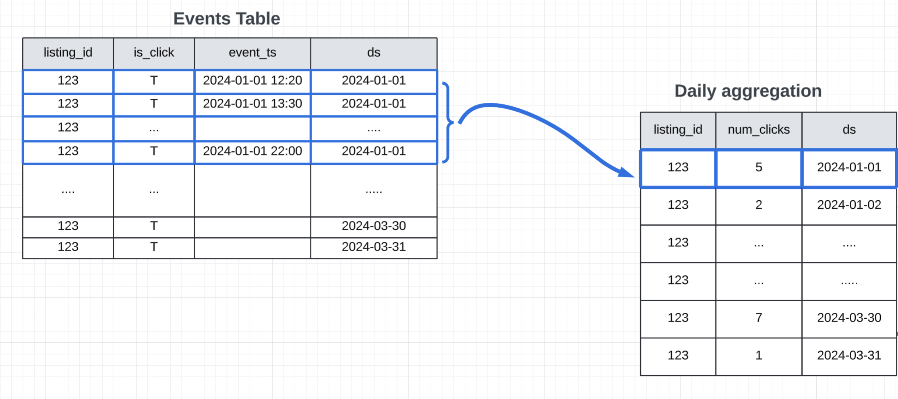

# Problem Statement

Chronon reads data partitions based on window sizes to compute features for event sources. For example

* sum_clicks_past_30days          ←  30 day window
* count_visits_past_90days         ←  90 day window

When computing aggregations, one of the major time taking tasks is reading data from disk. If a feature needs 90 days lookback, Chronon reads 90 days event data to compute.


This CHIP is to add support for incremental aggregation which will avoid reading full dataset everytime. 


# Proposed Solution

Divide the aggregate computation into 2 parts.
* **Daily Aggregation** - Includes reading one day partition and store partial aggregates
* **Final Aggregation** - Read all partial aggregates and compute the final aggregates

For the above 2 steps to compute we assume

## Daily Aggregation IRs

Given a data source
* reads the latest partition and generates aggregated values (IRs)  
* These values will be stored in a new intermediate table.
* Schema of intermediate table is of IRs (different from final groupby output)



The above diagram shows the daily IRs for `count` aggregation

## Final Aggregation (Final feature values)

* Read the intermediate table and compute the final aggregates
* Number of partitions read depends on the window size

## Pros
* Daily aggregates reduces the amnount of data read from disk
* Final aggregation is done on the intermediate table which is smaller than the original data source.

## Cons
* Intermediate table is created for each groupby which increases the storage cost
* Any changes in datasource will require re-computation of intermediate table.

## Optimizations

The proposed solution is a good start but can be improved further for invertible operators. Invertible operators are those which can be deleted. For example, `count` and `sum` are invertible operators.

### Requirements

* Previous day's groupBy output.   
  * groupBy values are basically ML features. So will refer this as `feature store`
* User activity table with latest and historical partitions.   


### Usecases
#### Case 1 : Unwindowed deletable

> Eg:  how many listings purchased by the user since signup.

These features are not windowed, which means the feature calculation happens over the lifetime.


#### Case 2 : Windowed deletable
These features are windowed and has a inverse operator

> Eg: Number of listings(Count Aggregation) purchased by the user in the past 90 days


```python
GroupBy(
    sources=[table_name],
    keys=["key_col1", "key_col2"],
    aggregations=[
        Aggregation(
            input_column="inp_col",
            operation=Operation.COUNT,
            windows=[
                Window(length=3, timeUnit=TimeUnit.DAYS),
                Window(length=10, timeUnit=TimeUnit.DAYS)

            ]
        )],
    accuracy=Accuracy.SNAPSHOT
)
```
To compute above groupBy incrementally
* Read the output table from groupby to get previous day’s aggregated values
* Read _day 0_ to add the latest activity
* Read user activity on day 4, day 11 to delete the unwanted user data

#### Case 3: Windowed non-deletable

These features are windowed and does not have an inverse operator


> Eg: What is the max purchase price by the user in the past 30 days

For non-deletable operators, we will go with the current behavior of Chronon where we load all the data/partitions needed to compute feature.


### Pros
* For invertible operators, drastically reduces amount of data to read. 
  * No need to read daily aggregated IRs. 

### Cons
* Applicable for only invertible operators
* If there is one operator in a GroupBy which is non-invertible, then we need to read all the partitions.
* This introduces 2 paths to compute a groupBy.  
  * Invertible : Just read latest/specific partitions and feature store
  * Non-invertible : Read all partitions

# Implementation

## API Changes 

Add `incremental=True` if the feature compute needs to happen in incremental way in GroupBy API

```python
GroupBy(
    sources=[table_name],
    keys=["key_col1", "key_col2"],
    aggregations=[....],
    incremental_agg=True,
    accuracy=Accuracy.SNAPSHOT
)
```
Need thrift changes for the flag